---
## Front matter
lang: ru-RU
title: Лабораторная работа 1
subtitle: Простые модели компьютерной сети
author:
  - Клюкин М. А.
institute:
  - Российский университет дружбы народов, Москва, Россия
  

## i18n babel
babel-lang: russian
babel-otherlangs: english

## Formatting pdf
toc: false
toc-title: Содержание
slide_level: 2
aspectratio: 169
section-titles: true
theme: metropolis
header-includes:
 - \metroset{progressbar=frametitle,sectionpage=progressbar,numbering=fraction}
 - \usepackage{fontspec}
 - \usepackage{polyglossia}
 - \setmainlanguage{russian}
 - \setotherlanguage{english}
 - \newfontfamily\cyrillicfont{Arial}
 - \newfontfamily\cyrillicfontsf{Arial}
 - \newfontfamily\cyrillicfonttt{Arial}
 - \setmainfont{Arial}
 - \setsansfont{Arial}
 
---

## Докладчик

:::::::::::::: {.columns align=center}
::: {.column width="70%"}

  * Клюкин Михаил Александрович
  * студент
  * Российский университет дружбы народов
  * [1132226431@pruf.ru](mailto:1132226431@pfur.ru)
  * <https://MaKYaro.github.io/ru/>

:::
::: {.column width="30%"}

:::
::::::::::::::

## Цели

Приобрести навыки моделирования сетей передачи данных с помощью средства имитацинного моделирования NS-2.
А также проанализировать полученные результаты моделирования.

## Задание

1. Создать шаблон сценария для NS-2;
2. Выполнить простой пример описания топологии сети, состоящей из двух узлов и одного соединения;
3. Выполнить пример с усложненной топологией сети;
4. Выполнить пример с кольцевой топологией сети;
5. Выполнить упражнение.

# Выполнение лабораторной работы

## Шаблон сценария для NS-2

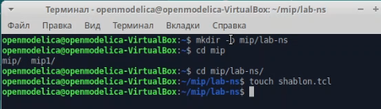{#fig:001 width=70%}

## Шаблон сценария для NS-2

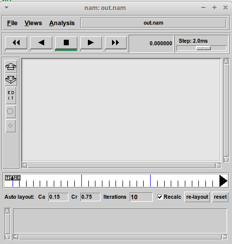{#fig:002 width=40%}

## Простой пример описания топологии сети, состоящей из двух узлов и одного соединения

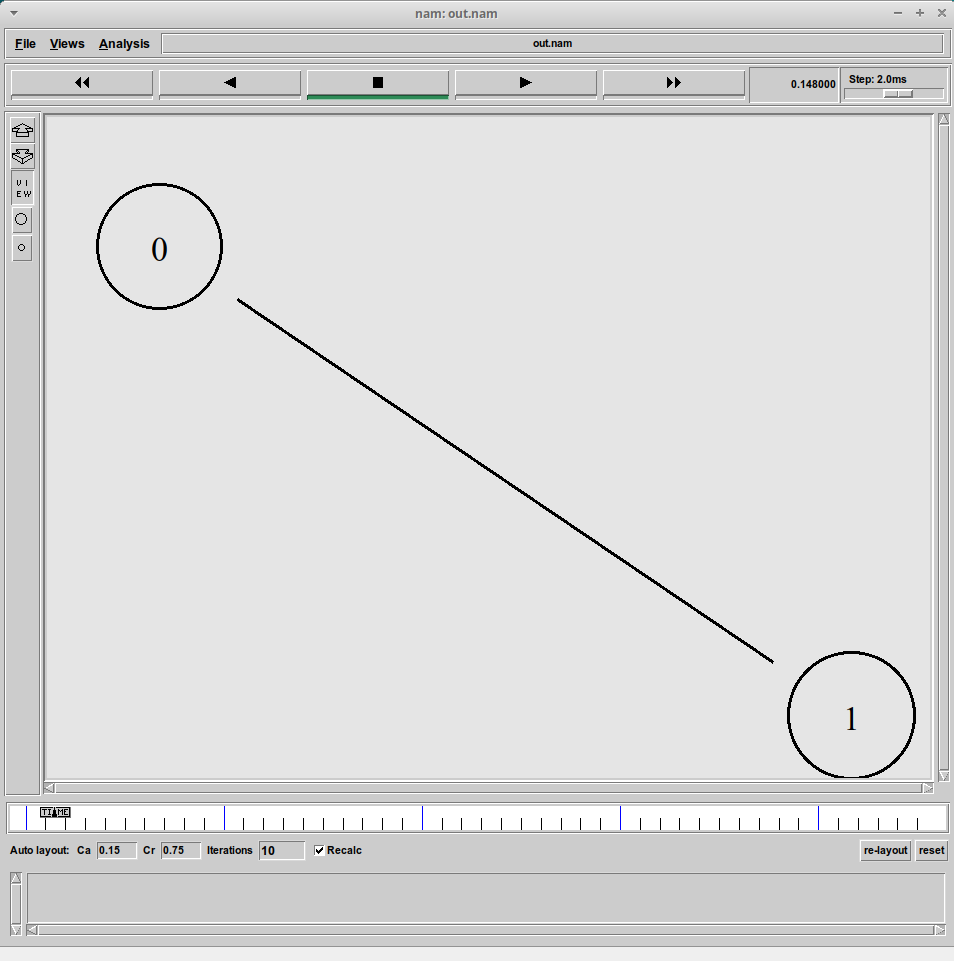{#fig:003 width=40%}

## Простой пример описания топологии сети, состоящей из двух узлов и одного соединения

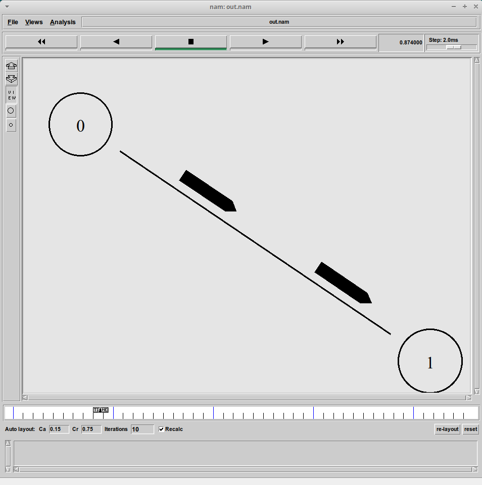{#fig:004 width=40%}

## Пример с усложненной топологией сети

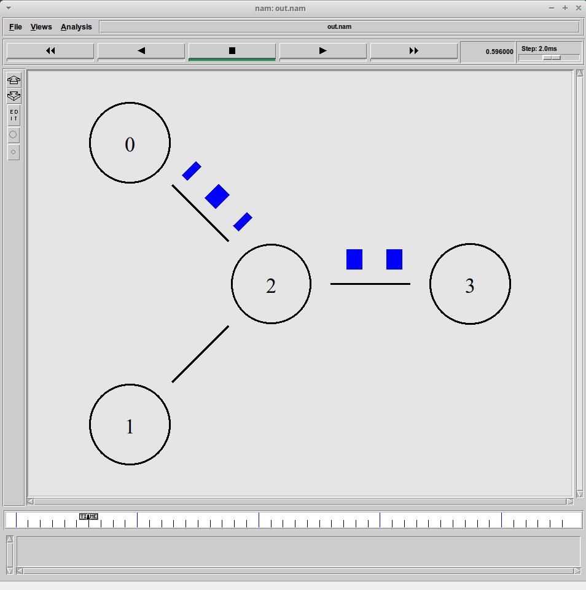{#fig:005 width=40%}

## Пример с усложненной топологией сети

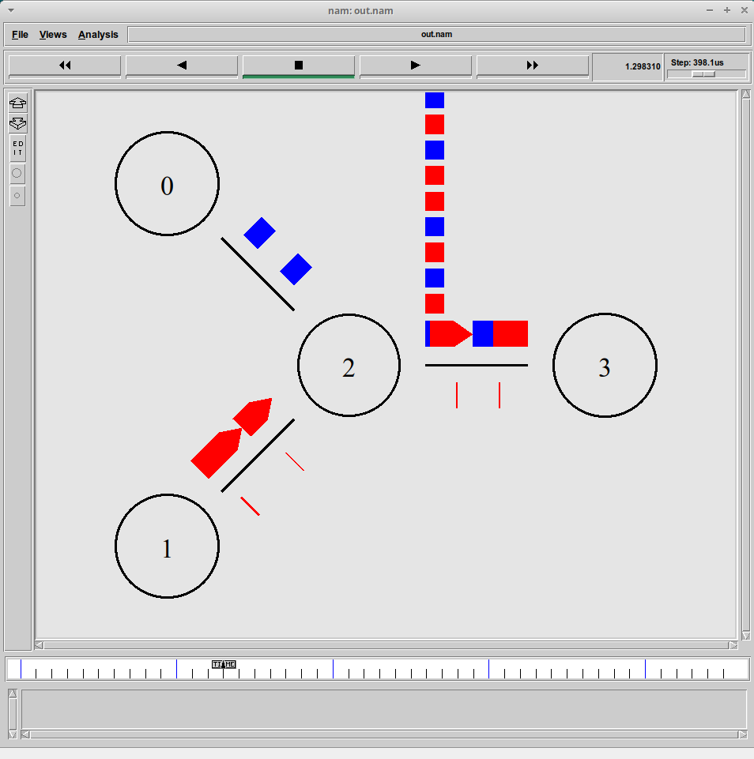{#fig:007 width=40%}

## Пример с усложненной топологией сети

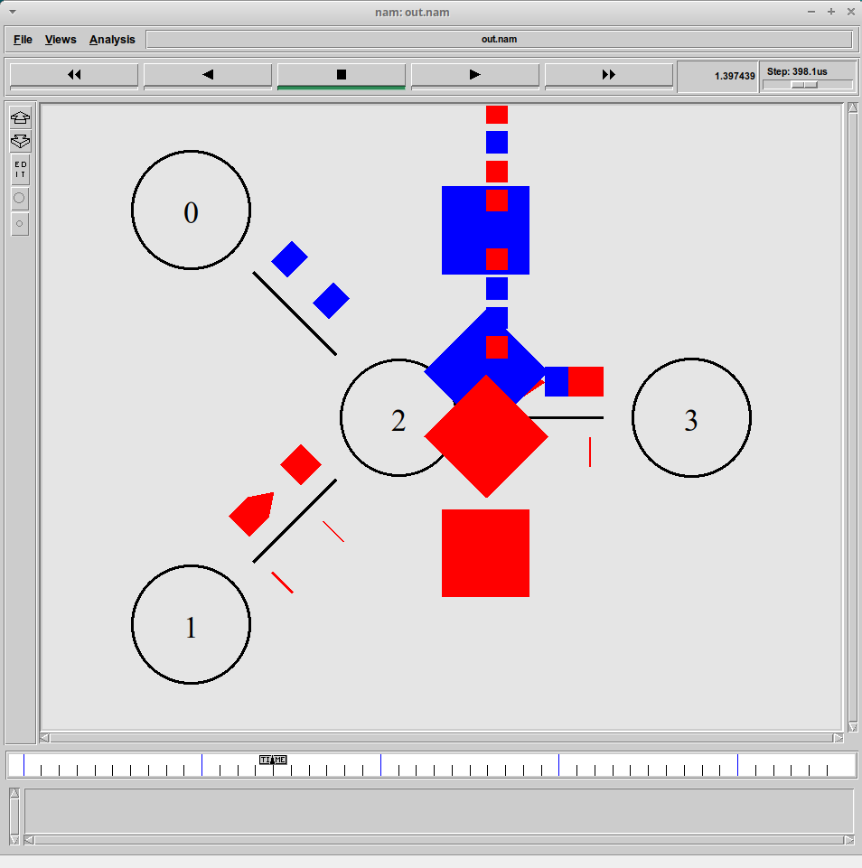{#fig:008 width=40%}

## Пример с кольцевой топологией

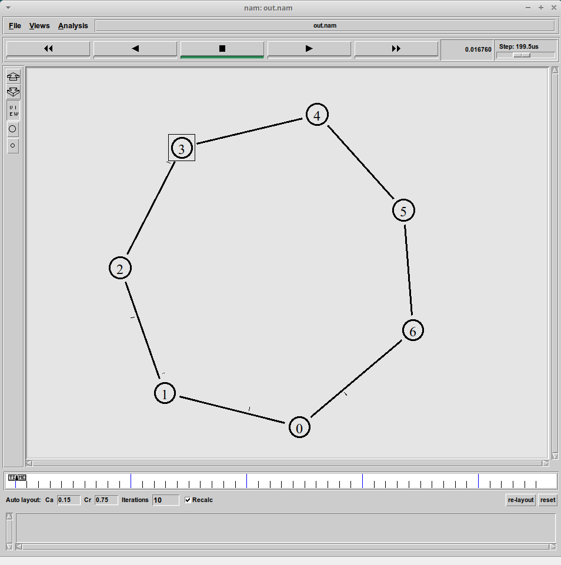{#fig:009 width=40%}

## Пример с кольцевой топологией

{#fig:010 width=40%}

## Пример с кольцевой топологией

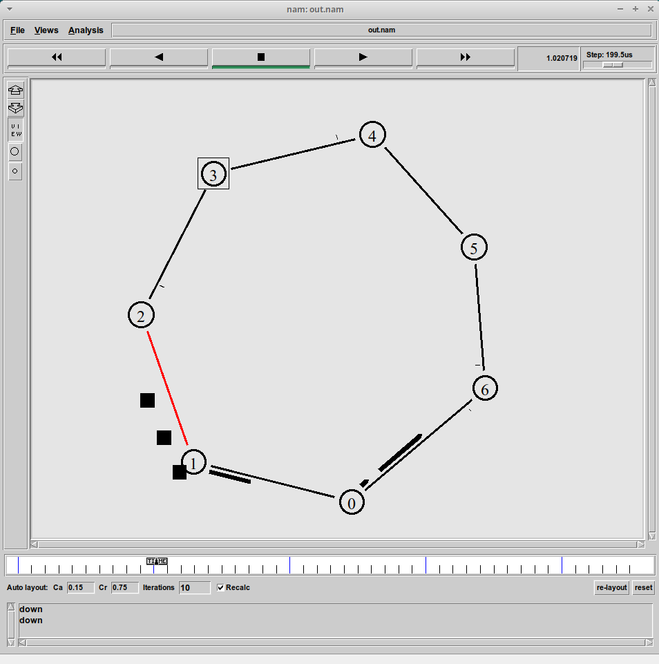{#fig:011 width=40%}

## Пример с кольцевой топологией

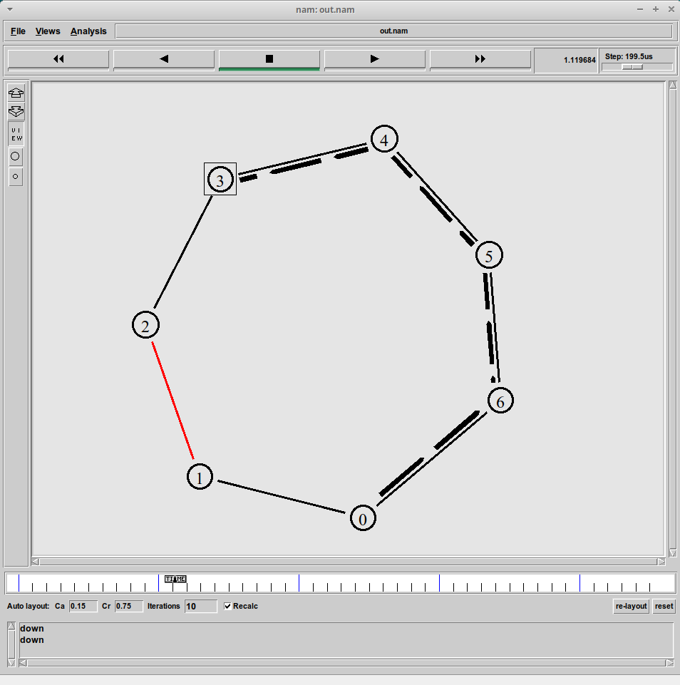{#fig:012 width=40%}

## Упражнение

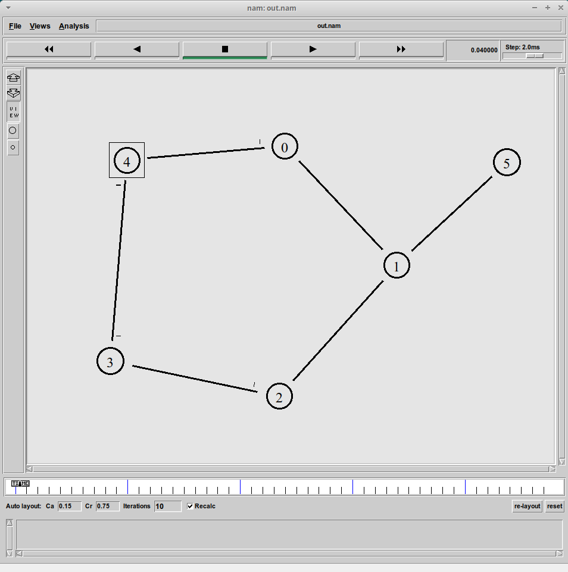{#fig:015 width=40%}

## Упражнение

{#fig:016 width=40%}

## Упражнение

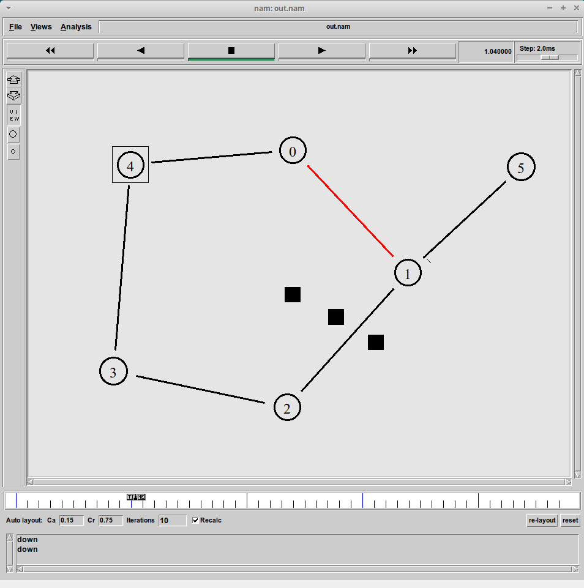{#fig:017 width=40%}

## Упражнение

{#fig:018 width=40%}

## Упражнение

{#fig:019 width=40%}

## Выводы

В процессе выполнения лабораторной работы приобрели навыки моделирования сетей передачи данных с помощью средств имитационного моделирования NS-2, а также проанализировали полученные результаты моделирования.
