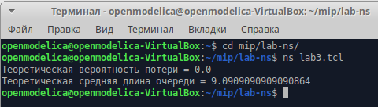
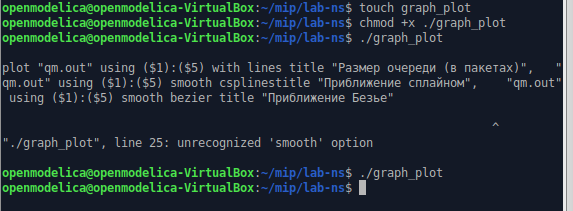
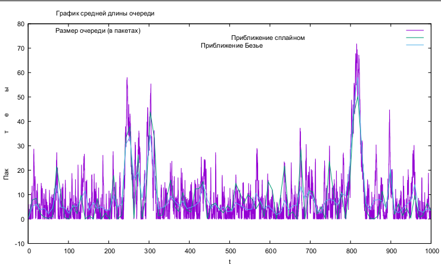

---
## Front matter
lang: ru-RU
title: Лабораторная работа 3
subtitle: Моделирование стохастических процессов
author:
  - Клюкин М. А.
institute:
  - Российский университет дружбы народов, Москва, Россия
  

## i18n babel
babel-lang: russian
babel-otherlangs: english

## Formatting pdf
toc: false
toc-title: Содержание
slide_level: 2
aspectratio: 169
section-titles: true
theme: metropolis
header-includes:
 - \metroset{progressbar=frametitle,sectionpage=progressbar,numbering=fraction}
 - \usepackage{fontspec}
 - \usepackage{polyglossia}
 - \setmainlanguage{russian}
 - \setotherlanguage{english}
 - \newfontfamily\cyrillicfont{Arial}
 - \newfontfamily\cyrillicfontsf{Arial}
 - \newfontfamily\cyrillicfonttt{Arial}
 - \setmainfont{Arial}
 - \setsansfont{Arial}
 
---


## Докладчик

:::::::::::::: {.columns align=center}
::: {.column width="70%"}

  * Клюкин Михаил Александрович
  * студент
  * Российский университет дружбы народов
  * [1132226431@pruf.ru](mailto:1132226431@pfur.ru)
  * <https://MaKYaro.github.io/ru/>

:::
::: {.column width="30%"}


:::
::::::::::::::

## Цель работы

Провести моделирование системы массового обслуживания.

## Задание

1. Реализовать модель $M|M|1$;
2. Посчитать загрузку системы и вероятность потери пакетов;
3. Построить график изменения размера очереди.

## Выполнение лабораторной работы

```
# задаём значения параметров системы
set lambda 30.0
set mu 33.0
# размер очереди для M|M|1 (для M|M|1|R: set qsize R)
set qsize 100000
# устанавливаем длительность эксперимента
set duration 1000.0
```

## Выполнение лабораторной работы

```
# задаём узлы и соединяем их симплексным соединением
# с полосой пропускания 100 Кб/с и задержкой 0 мс,
# очередью с обслуживанием типа DropTail
set n1 [$ns node]
set n2 [$ns node]
set link [$ns simplex-link $n1 $n2 100kb 0ms DropTail]
# наложение ограничения на размер очереди:
$ns queue-limit $n1 $n2 $qsize
# задаём распределения интервалов времени
# поступления пакетов и размера пакетов
set InterArrivalTime [new RandomVariable/Exponential]
$InterArrivalTime set avg_ [expr 1/$lambda]
set pktSize [new RandomVariable/Exponential]
$pktSize set avg_ [expr 100000.0/(8*$mu)]
```

## Выполнение лабораторной работы

```
# задаём агент UDP и присоединяем его к источнику,
# задаём размер пакета
set src [new Agent/UDP]
$src set packetSize_ 100000
$ns attach-agent $n1 $src
# задаём агент-приёмник и присоединяем его
set sink [new Agent/Null]
$ns attach-agent $n2 $sink
$ns connect $src $sink
# мониторинг очереди
set qmon [$ns monitor-queue $n1 $n2 [open qm.out w] 0.1]
$link queue-sample-timeout
```

## Выполнение лабораторной работы

```
# процедура finish закрывает файлы трассировки
proc finish {} {
  global ns tf
  $ns flush-trace
  close $tf
  exit 0
}
# процедура случайного генерирования пакетов
proc sendpacket {} {
  global ns src InterArrivalTime pktSize
  set time [$ns now]
  $ns at [expr $time +[$InterArrivalTime value]] "sendpacket"
  set bytes [expr round ([$pktSize value])]
  $src send $bytes
}
```

## Выполнение лабораторной работы

```
# расчет загрузки системы и вероятности потери пакетов
set rho [expr $lambda/$mu]
set ploss [expr (1-$rho)*pow($rho,$qsize)/(1-pow($rho,($qsize+1)))]
puts "Теоретическая вероятность потери = $ploss"

set aveq [expr $rho*$rho/(1-$rho)]
puts "Теоретическая средняя длина очереди = $aveq"
# запуск модели
$ns run
```

## Выполнение лабораторной работы

{#fig:001 width=70%}

## Выполнение лабораторной работы

```
#!/usr/bin/gnuplot -persist
# задаём текстовую кодировку,
# тип терминала, тип и размер шрифта
set encoding utf8
set term pdfcairo font "Arial,9"
# задаём выходной файл графика
set out 'qm.pdf'
# задаём название графика
set title "График средней длины очереди"
```

## Выполнение лабораторной работы

```
# задаём стиль линии
set style line 2
# подписи осей графика
set xlabel "t"
set ylabel "Пакеты"
# построение графика, используя значения
# 1-го и 5-го столбцов файла qm.out
plot "qm.out" using ($1):($5) with lines title "Размер очереди (в пакетах)",\
	"qm.out" using ($1):($5) smooth csplines title "Приближение сплайном", \
	"qm.out" using ($1):($5) smooth bezier title "Приближение Безье"
```

## Выполнение лабораторной работы

{#fig:002 width=70%}

## Выполнение лабораторной работы

{#fig:003 width=70%}


## Выводы

В процессе выполнения данной лабораторной работы провели моделирование системы массового обслуживания.
