---
## Front matter
lang: ru-RU
title: Лабораторная работа 6
subtitle: Модель хищник-жертва
author:
  - Клюкин М. А.
institute:
  - Российский университет дружбы народов, Москва, Россия
  

## i18n babel
babel-lang: russian
babel-otherlangs: english

## Formatting pdf
toc: false
toc-title: Содержание
slide_level: 2
aspectratio: 169
section-titles: true
theme: metropolis
header-includes:
 - \metroset{progressbar=frametitle,sectionpage=progressbar,numbering=fraction}
 - \usepackage{fontspec}
 - \usepackage{polyglossia}
 - \setmainlanguage{russian}
 - \setotherlanguage{english}
 - \newfontfamily\cyrillicfont{Arial}
 - \newfontfamily\cyrillicfontsf{Arial}
 - \newfontfamily\cyrillicfonttt{Arial}
 - \setmainfont{Arial}
 - \setsansfont{Arial}
 
---


## Докладчик

:::::::::::::: {.columns align=center}
::: {.column width="70%"}

  * Клюкин Михаил Александрович
  * студент
  * Российский университет дружбы народов
  * [1132226431@pruf.ru](mailto:1132226431@pfur.ru)
  * <https://MaKYaro.github.io/ru/>

:::
::: {.column width="30%"}


:::
::::::::::::::

## Цель работы
Реализовать модель хищник-жертва в xcos.

## Задание

1. Реализовать модель хищник-жертва в xcos.
2. Реализовать модель хищник-жертва в xcos с помощью блока Modelica.
3. Реализовать модель хищник-жертва в OpenModelica.

## Выполнение работы

$$
\begin{cases}
  \dot x = ax - bxy;
  \dot y = cxy - dy,
\end{cases}
$$

где $x$ — количество жертв; $y$ — количество хищников; $a, b, c, d$ — коэффициен-ты, отражающие взаимодействия между видами: $a$ — коэффициент рождаемости жертв; $b$ — коэффициент убыли жертв; $c$ — коэффициент рождения хищников; $d$ — коэффициент убыли хищников.

## Реализация модели в xcos

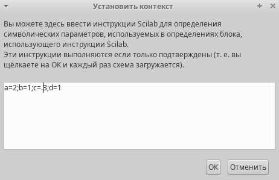{#fig:001 width=70%}


## Реализация модели в xcos

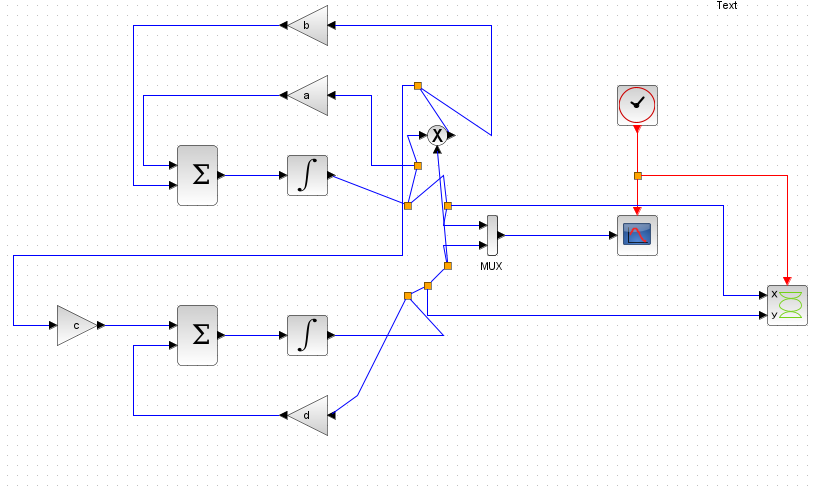{#fig:002 width=70%}

## Реализация модели в xcos

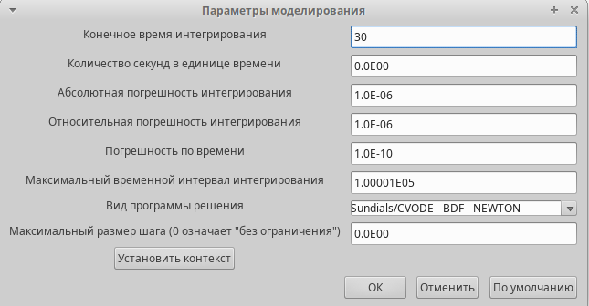{#fig:003 width=70%}

## Реализация модели в xcos

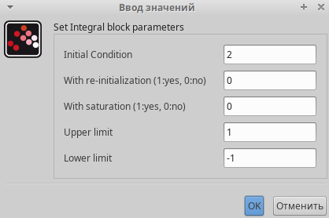{#fig:004 width=70%}

## Реализация модели в xcos

{#fig:005 width=70%}

## Реализация модели в xcos

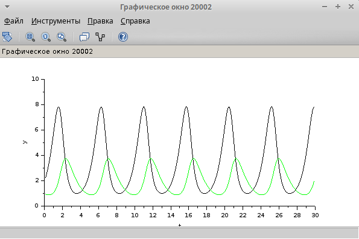{#fig:006 width=70%}

## Реализация модели в xcos

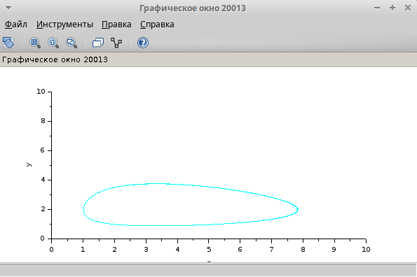{#fig:007 width=70%}

## Реализация модели с помощью блока Modelica

{#fig:008 width=70%}

## Реализация модели с помощью блока Modelica

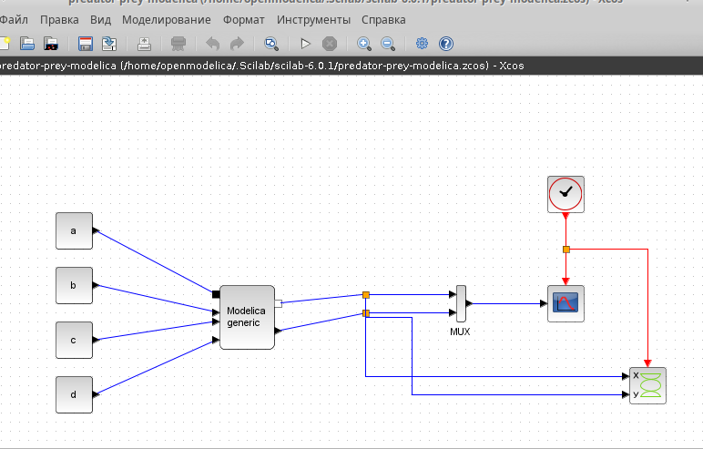{#fig:009 width=70%}

## Реализация модели с помощью блока Modelica

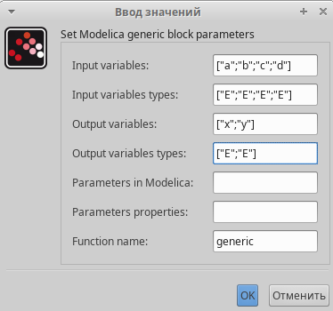{#fig:010 width=70%}

## Реализация модели с помощью блока Modelica

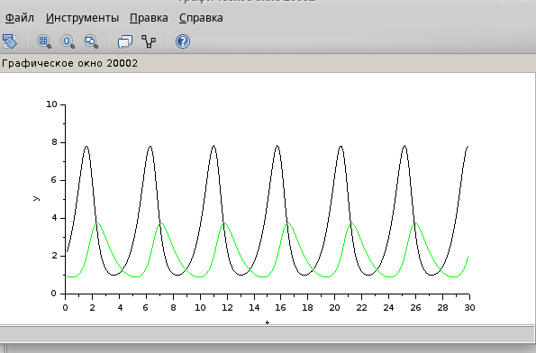{#fig:011 width=70%}

## Реализация модели с помощью блока Modelica

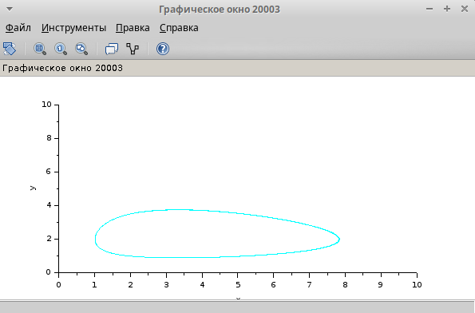{#fig:012 width=70%}

## Упражнение

```
  parameter Real a = 2;
  parameter Real b = 1;
  parameter Real c = 0.3;
  parameter Real d = 1;
  parameter Real x0 = 2;
  parameter Real y0 = 1;

  Real x(start=x0);
  Real y(start=y0);
equation
  der(x) = a*x - b*x*y;
  der(y) = c*x*y - d*y;
```

## Упражнение

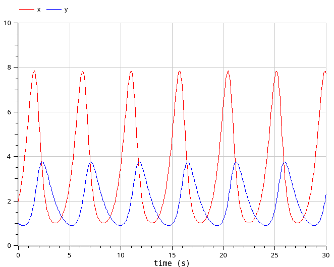{#fig:013 width=70%}

## Упражнение

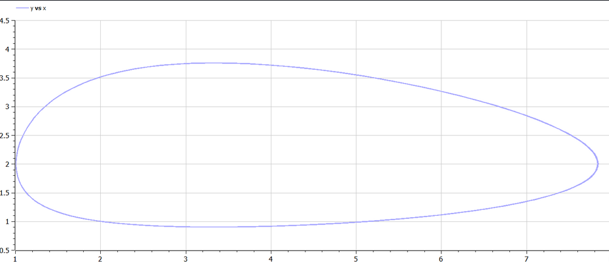{#fig:014 width=70%}

## Выводы

В результате выполнения лабораторной работы реализована модель хищник-жертва в xcos, с помощью блока Modelica и OpenModelica.

