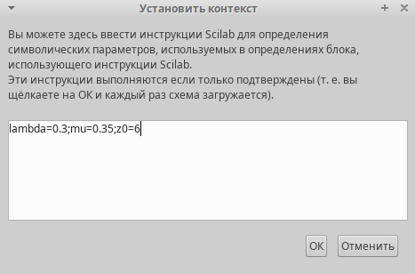
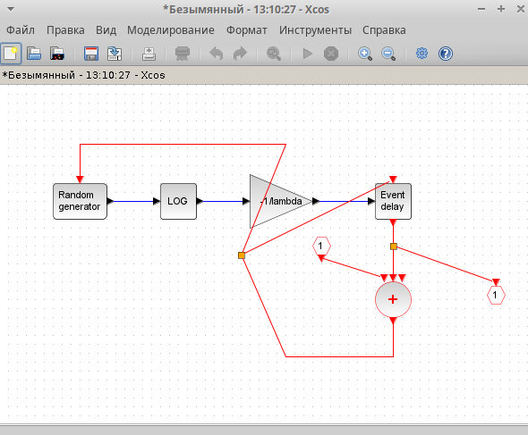
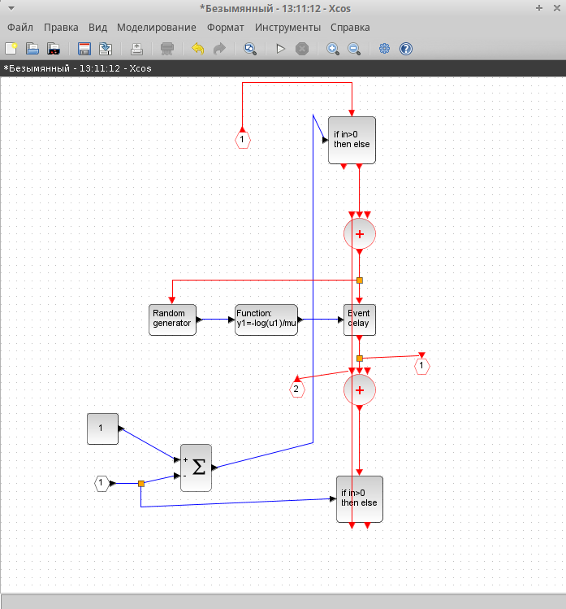
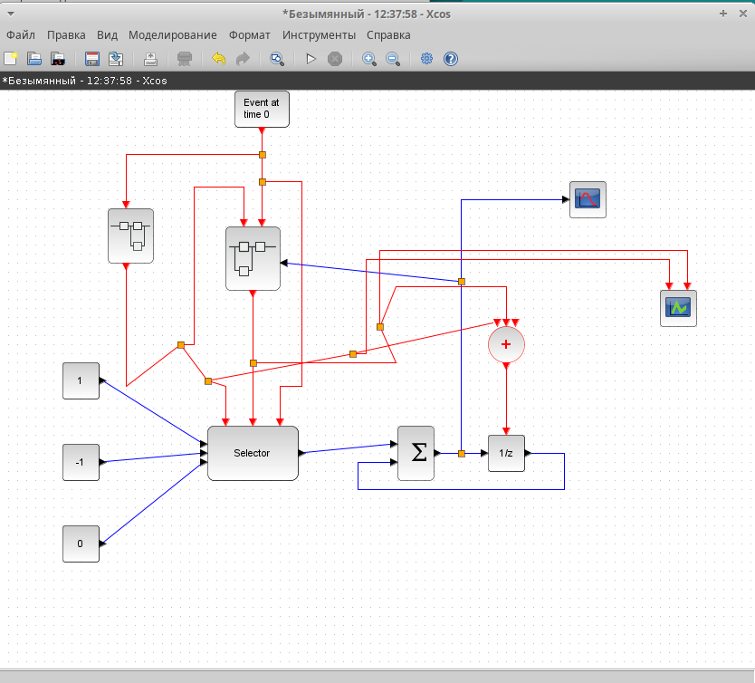
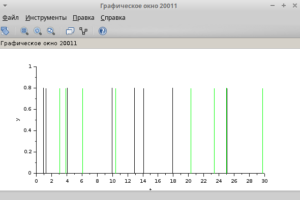
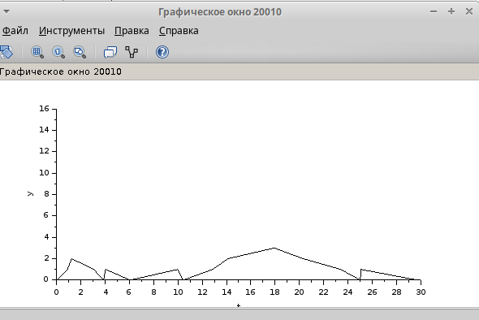

---
## Front matter
lang: ru-RU
title: Лабораторная работа 7
subtitle: Модель M|M|1|
author:
  - Клюкин М. А.
institute:
  - Российский университет дружбы народов, Москва, Россия
  

## i18n babel
babel-lang: russian
babel-otherlangs: english

## Formatting pdf
toc: false
toc-title: Содержание
slide_level: 2
aspectratio: 169
section-titles: true
theme: metropolis
header-includes:
 - \metroset{progressbar=frametitle,sectionpage=progressbar,numbering=fraction}
 - \usepackage{fontspec}
 - \usepackage{polyglossia}
 - \setmainlanguage{russian}
 - \setotherlanguage{english}
 - \newfontfamily\cyrillicfont{Arial}
 - \newfontfamily\cyrillicfontsf{Arial}
 - \newfontfamily\cyrillicfonttt{Arial}
 - \setmainfont{Arial}
 - \setsansfont{Arial}
 
---

## Докладчик

:::::::::::::: {.columns align=center}
::: {.column width="70%"}

  * Клюкин Михаил Александрович
  * студент
  * Российский университет дружбы народов
  * [1132226431@pruf.ru](mailto:1132226431@pfur.ru)
  * <https://MaKYaro.github.io/ru/>

:::
::: {.column width="30%"}

:::
::::::::::::::

## Цель работы

Смоделировать в xcos систему массового обслуживания $M|M|1|\infty$.

## Задание

1. Реализовать модель системы массового обслуживания типа $M|M|1|\infty$.
2. Построить график поступления и обработки заявок.
3. Построить график изменения размера очереди.

## Выполнение лабораторной работы

{#fig:001 width=70%}

## Выполнение лабораторной работы

{#fig:002 width=70%}

## Выполнение лабораторной работы

{#fig:003 width=70%}

## Выполнение лабораторной работы

{#fig:004 width=70%}

## Выполнение лабораторной работы

{#fig:005 width=70%}

## Выполнение лабораторной работы

{#fig:006 width=70%}

## Выводы

В результате выполнения лабораторной работы смоделировать в xcos систему массового обслуживания $M|M|1|\infty$.

