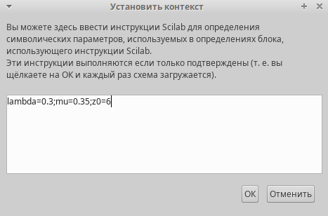
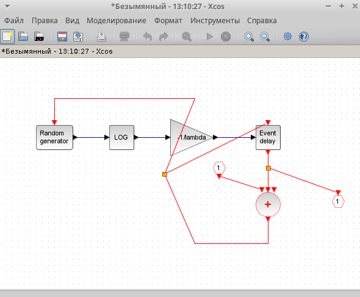
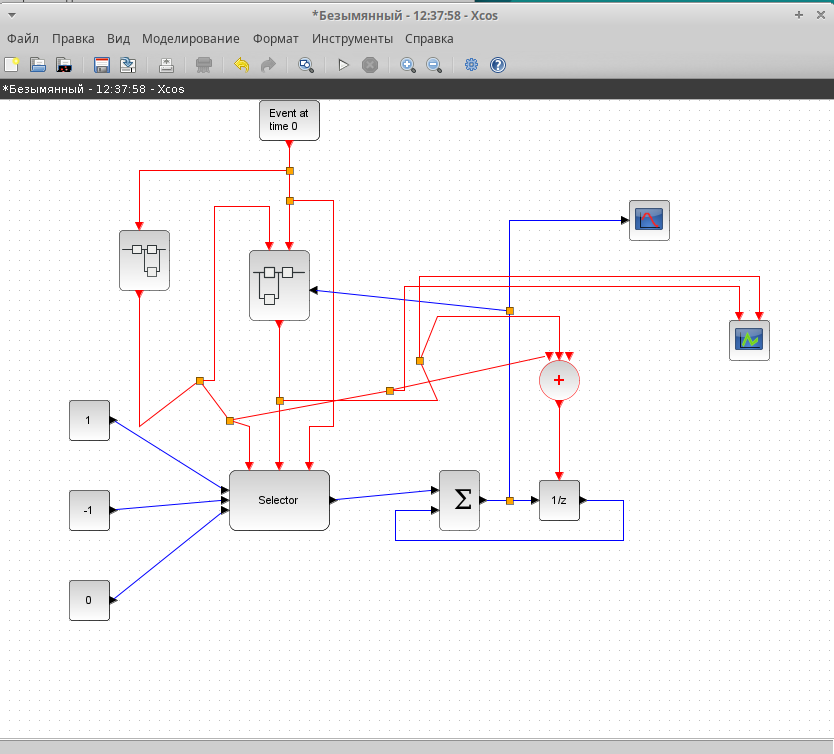
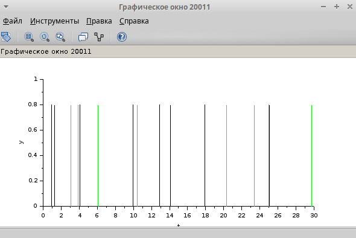

---
## Front matter
title: "Лабораторная работа 7"
subtitle: "Модель M|M|1|"
author: "Клюкин Михаил Александрович"

## Generic otions
lang: ru-RU
toc-title: "Содержание"

## Bibliography
bibliography: bib/cite.bib
csl: pandoc/csl/gost-r-7-0-5-2008-numeric.csl

## Pdf output format
toc: true # Table of contents
toc-depth: 2
lof: true # List of figures
lot: true # List of tables
fontsize: 12pt
linestretch: 1.5
papersize: a4
documentclass: scrreprt
## I18n polyglossia
polyglossia-lang:
  name: russian
  options:
	- spelling=modern
	- babelshorthands=true
polyglossia-otherlangs:
  name: english
## I18n babel
babel-lang: russian
babel-otherlangs: english
## Fonts
mainfont: IBM Plex Serif
romanfont: IBM Plex Serif
sansfont: IBM Plex Sans
monofont: IBM Plex Mono
mathfont: STIX Two Math
mainfontoptions: Ligatures=Common,Ligatures=TeX,Scale=0.94
romanfontoptions: Ligatures=Common,Ligatures=TeX,Scale=0.94
sansfontoptions: Ligatures=Common,Ligatures=TeX,Scale=MatchLowercase,Scale=0.94
monofontoptions: Scale=MatchLowercase,Scale=0.94,FakeStretch=0.9
mathfontoptions:
## Biblatex
biblatex: true
biblio-style: "gost-numeric"
biblatexoptions:
  - parentracker=true
  - backend=biber
  - hyperref=auto
  - language=auto
  - autolang=other*
  - citestyle=gost-numeric
## Pandoc-crossref LaTeX customization
figureTitle: "Рис."
tableTitle: "Таблица"
listingTitle: "Листинг"
lofTitle: "Список иллюстраций"
lotTitle: "Список таблиц"
lolTitle: "Листинги"
## Misc options
indent: true
header-includes:
  - \usepackage{indentfirst}
  - \usepackage{float} # keep figures where there are in the text
  - \floatplacement{figure}{H} # keep figures where there are in the text
---

# Цель работы

Смоделировать в xcos систему массового обслуживания $M|M|1|\inf$.

# Задание

1. Реализовать модель системы массового обслуживания типа $M|M|1|\inf$.
2. Построить график поступления и обработки заявок.
3. Построить график изменения размера очереди.

# Выполнение лабораторной работы

Зафиксировали переменные окружения: $\lambda = 0.3, \mu = 0.35, z_0 = 6$ (рис. [-@fig:001]).

{#fig:001 width=70%}

Создали суперблок, моделирующий поступление заявки в систему (рис. [-@fig:002]).

{#fig:002 width=70%}

В этом суперблоке поступившая заявка идет в синхронизатор входных и выходных данных.
Заявки равномерно распределены на интервале $[0; 1]$.
Равномерное распределение заявок преобразуется в эксопоненциальное.
Заявка попадает в обработчик событий и выходит из суперблока.

Создали суперблок, моделирующий обработку заявок (рис. [-@fig:003]).

{#fig:003 width=70%}

Заявки берутся из очереди и обрабатываются по экспоненциальному закону.

Используя суперблоки, моделирующие поступление и обработку заявок, создали модель $M|M|1|\inf$ (рис. [-@fig:004]).

{#fig:004 width=70%}

При построении модели использовались селектор, два суперблока, генератор инициирующего события, сумматор, оператор задержки, регистратор размера очереди и регистратор событий.

В результате получили график изменения размера очереди (рис. [-@fig:006]) и график поступления и обработки заявок (рис. [-@fig:005]).

{#fig:005 width=70%}

{#fig:006 width=70%}

# Выводы

В результате выполнения лабораторной работы смоделировать в xcos систему массового обслуживания $M|M|1|\inf$.

# Список литературы{.unnumbered}

::: {#refs}
:::
