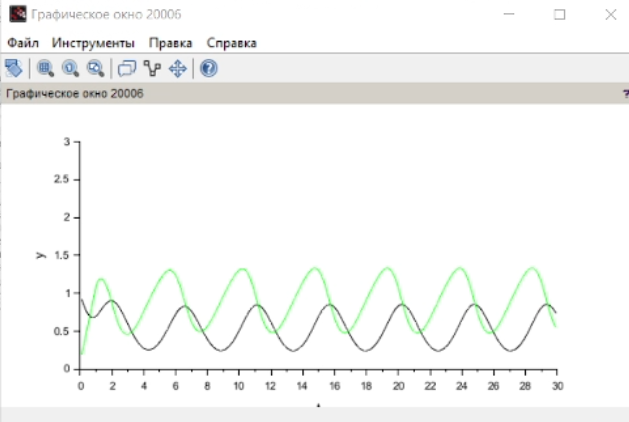

---
## Front matter
lang: ru-RU
title: Лабораторная работа 8
subtitle: Модель TCP/AQM
author:
  - Клюкин М. А.
institute:
  - Российский университет дружбы народов, Москва, Россия
  

## i18n babel
babel-lang: russian
babel-otherlangs: english

## Formatting pdf
toc: false
toc-title: Содержание
slide_level: 2
aspectratio: 169
section-titles: true
theme: metropolis
header-includes:
 - \metroset{progressbar=frametitle,sectionpage=progressbar,numbering=fraction}
 - \usepackage{fontspec}
 - \usepackage{polyglossia}
 - \setmainlanguage{russian}
 - \setotherlanguage{english}
 - \newfontfamily\cyrillicfont{Arial}
 - \newfontfamily\cyrillicfontsf{Arial}
 - \newfontfamily\cyrillicfonttt{Arial}
 - \setmainfont{Arial}
 - \setsansfont{Arial}
 
---


## Докладчик

:::::::::::::: {.columns align=center}
::: {.column width="70%"}

  * Клюкин Михаил Александрович
  * студент
  * Российский университет дружбы народов
  * [1132226431@pruf.ru](mailto:1132226431@pfur.ru)
  * <https://MaKYaro.github.io/ru/>

:::
::: {.column width="30%"}


:::
::::::::::::::

## Цель работы

Реализовать модель TCP/AQM в xcos и OpenModelica.

## Задания

1. Построить модель TCP/AQM в xcos.
2. Построить графики изменения размера TCP окна $W(t)$ и размера очереди $Q(t)$.
3. Построить модель TCP/AQM в OpenModelica.

## Реализация в xcos

{#fig:001 width=70%}

## Реализация в xcos

{#fig:002 width=70%}

## Реализация в xcos

{#fig:003 width=70%}

## Реализация в xcos

{#fig:004 width=70%}

## Реализация в xcos

{#fig:005 width=70%}

## Реализация в xcos

{#fig:006 width=70%}

## Реализация модели в OpenModelica

```
parameter Real N=1;
parameter Real R=1;
parameter Real K=5.3;
parameter Real C=1;
```

## Реализация модели в OpenModelica

```
Real W(start=0.1);
Real Q(start=1);
```

## Реализация модели в OpenModelica

```
der(W) = 1/R - W*delay(W, R)/(2*R)*K*delay(Q, R);
der(Q) = if (Q==0) then max(N*W/R-C,0) else (N*W/R-C);
```

## Реализация модели в OpenModelica

{#fig:007 width=70%}

## Реализация модели в OpenModelica

{#fig:008 width=70%}

## Выводы

В процессе выполнения лабораторной работы реализовали модель TCP/AQM в xcos и OpenModelica.


