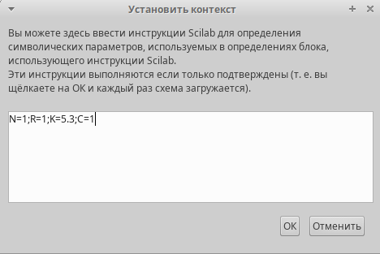
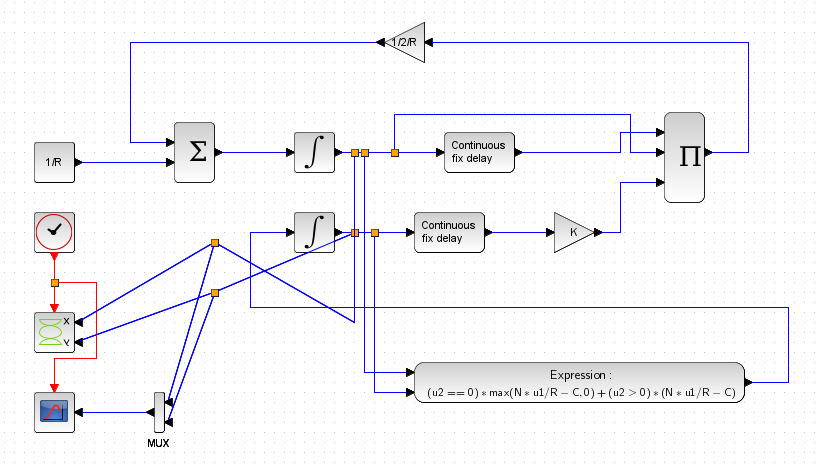
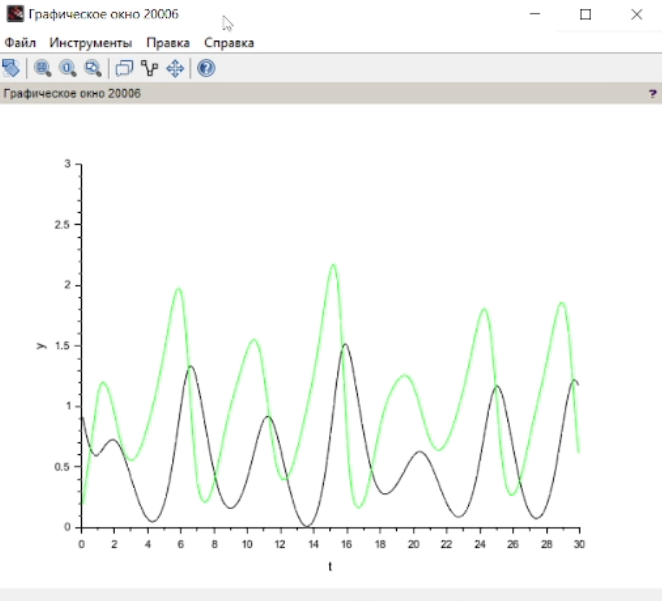
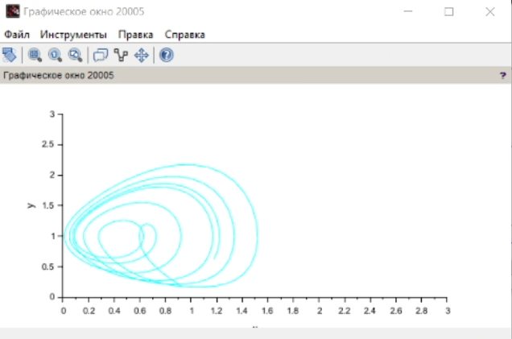
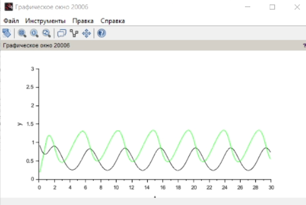
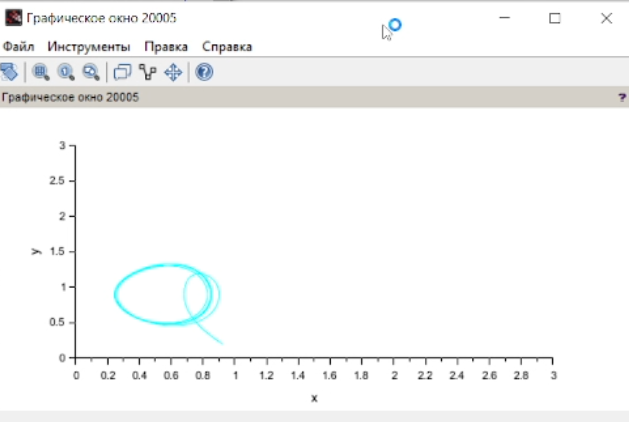
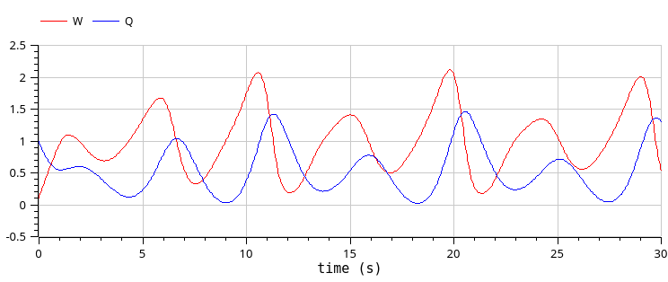
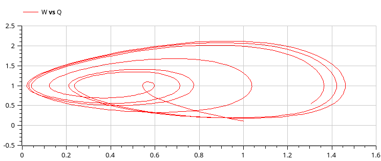

---
## Front matter
title: "Лабораторная работа 8"
subtitle: "Модель TCP/AQM"
author: "Клюкин Михаил Александрович"

## Generic otions
lang: ru-RU
toc-title: "Содержание"

## Bibliography
bibliography: bib/cite.bib
csl: pandoc/csl/gost-r-7-0-5-2008-numeric.csl

## Pdf output format
toc: true # Table of contents
toc-depth: 2
lof: true # List of figures
lot: true # List of tables
fontsize: 12pt
linestretch: 1.5
papersize: a4
documentclass: scrreprt
## I18n polyglossia
polyglossia-lang:
  name: russian
  options:
	- spelling=modern
	- babelshorthands=true
polyglossia-otherlangs:
  name: english
## I18n babel
babel-lang: russian
babel-otherlangs: english
## Fonts
mainfont: IBM Plex Serif
romanfont: IBM Plex Serif
sansfont: IBM Plex Sans
monofont: IBM Plex Mono
mathfont: STIX Two Math
mainfontoptions: Ligatures=Common,Ligatures=TeX,Scale=0.94
romanfontoptions: Ligatures=Common,Ligatures=TeX,Scale=0.94
sansfontoptions: Ligatures=Common,Ligatures=TeX,Scale=MatchLowercase,Scale=0.94
monofontoptions: Scale=MatchLowercase,Scale=0.94,FakeStretch=0.9
mathfontoptions:
## Biblatex
biblatex: true
biblio-style: "gost-numeric"
biblatexoptions:
  - parentracker=true
  - backend=biber
  - hyperref=auto
  - language=auto
  - autolang=other*
  - citestyle=gost-numeric
## Pandoc-crossref LaTeX customization
figureTitle: "Рис."
tableTitle: "Таблица"
listingTitle: "Листинг"
lofTitle: "Список иллюстраций"
lotTitle: "Список таблиц"
lolTitle: "Листинги"
## Misc options
indent: true
header-includes:
  - \usepackage{indentfirst}
  - \usepackage{float} # keep figures where there are in the text
  - \floatplacement{figure}{H} # keep figures where there are in the text
---

# Цель работы

Реализовать модель TCP/AQM в xcos и OpenModelica.

# Задание

1. Построить модель TCP/AQM в xcos.
2. Построить графики изменения размера TCP окна $W(t)$ и размера очереди $Q(t)$.
3. Построить модель TCP/AQM в OpenModelica.

# Выполнение лабораторной работы

## Реализация модели в xcos

Задали переменные окружения $N = 1, R = 1, K = 5.3, C = 1, W(0) = 0.1, Q(0) = 1$ (рис. [-@fig:001]).

{#fig:001 width=70%}

Реализовали саму модель TCP/AQM, используя блоки суммирования, интегрирования, произведения, констант, мультиплексера, регистрирующие устройства, задержки (рис. [-@fig:002]).

{#fig:002 width=70%}

В результате получили графики изменения размера окна $W(t)$ (зеленая линия) и размера очереди $Q(t)$ (черная линия) (рис. [-@fig:003]).

{#fig:003 width=70%}

А также получили фазовый портрет, который показывает наличие автоколебаний параметров системы (рис. [-@fig:004]).

{#fig:004 width=70%}

Уменьшили скорость обработки пакетов до $C$ до 0.9. И получили более выраженные автоколебания (рис. [-@fig:005], [-@fig:006]).

{#fig:005 width=70%}

{#fig:006 width=70%}

## Реализация модели в OpenModelica

Задали начальные значения, параметры и систему уравнений.

```
parameter Real N=1;
parameter Real R=1;
parameter Real K=5.3;
parameter Real C=1;

Real W(start=0.1);
Real Q(start=1);

equation

der(W) = 1/R - W*delay(W, R)/(2*R)*K*delay(Q, R);
der(Q) = if (Q==0) then max(N*W/R-C,0) else (N*W/R-C);
```

Выполнили симуляцию и получили графики изменения размера окна W(t) и размера очереди Q(t) (рис. [-@fig:007]).

{#fig:007 width=70%}

Также получили фазовый портрет (рис. [-@fig:008]).

{#fig:008 width=70%}


# Выводы

В процессе выполнения лабораторной работы реализовали модель TCP/AQM в xcos и OpenModelica.

# Список литературы{.unnumbered}

::: {#refs}
:::
