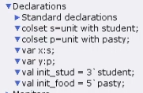

---
## Front matter
lang: ru-RU
title: Лабораторная работа 9
subtitle: Модель "Накорми студентов"
author:
  - Клюкин М. А.
institute:
  - Российский университет дружбы народов, Москва, Россия
  

## i18n babel
babel-lang: russian
babel-otherlangs: english

## Formatting pdf
toc: false
toc-title: Содержание
slide_level: 2
aspectratio: 169
section-titles: true
theme: metropolis
header-includes:
 - \metroset{progressbar=frametitle,sectionpage=progressbar,numbering=fraction}
 - \usepackage{fontspec}
 - \usepackage{polyglossia}
 - \setmainlanguage{russian}
 - \setotherlanguage{english}
 - \newfontfamily\cyrillicfont{Arial}
 - \newfontfamily\cyrillicfontsf{Arial}
 - \newfontfamily\cyrillicfonttt{Arial}
 - \setmainfont{Arial}
 - \setsansfont{Arial}
 
---


## Докладчик

:::::::::::::: {.columns align=center}
::: {.column width="70%"}

  * Клюкин Михаил Александрович
  * студент
  * Российский университет дружбы народов
  * [1132226431@pruf.ru](mailto:1132226431@pfur.ru)
  * <https://MaKYaro.github.io/ru/>

:::
::: {.column width="30%"}


:::
::::::::::::::

## Цель работы

Реализовать модель "Накорми студентов" в CPN Tools.

## Задание

1. Реализовать модель "Накорми студентов" в CPN Tools.
2. Вычислить пространство состояний, сформировать отчет, построить граф состояний.

## Выполнение работы

Рассмотрим пример студентов, которые обедают пирожками. Голодный студент становится сытым после того, как съедает пирог.

Таким образом, имеем:    

- два типа фишек: "пироги" и "студенты";   
- три позиции: "голодный студент", "пироги", "сытый студент";   
- один переход: "съесть пирожок".   

## Выполнение работы

{#fig:001 width=70%}

## Выполнение работы

{#fig:002 width=70%}

## Выполнение работы

{#fig:003 width=70%}

## Выполнение работы

{#fig:004 width=70%}

## Упражнение

```
 Statistics
------------------------------------------------------------------------

  State Space
     Nodes:  4
     Arcs:   3
     Secs:   0
     Status: Full

  Scc Graph
     Nodes:  4
     Arcs:   3
     Secs:   0
```

## Упражнение

```
 Boundedness Properties
------------------------------------------------------------------------

  Best Integer Bounds
                             Upper      Lower
     New_Page'food 1         5          2
     New_Page'hungry_student 1
                             3          0
     New_Page'satisfied_student 1
                             3          0
```

## Упражнение

{#fig:005 width=70%}

## Выводы

В результате выполнения лабораторной работы реализовали модель "Накорми студентов" в CPN Tools.
