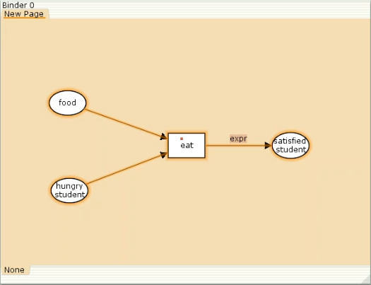
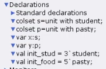
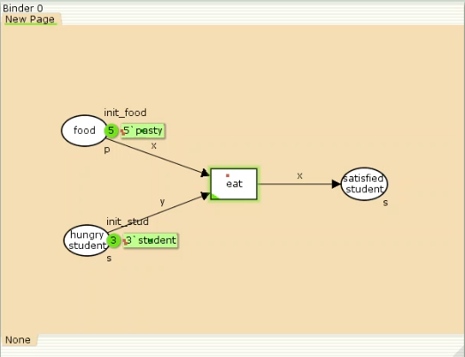
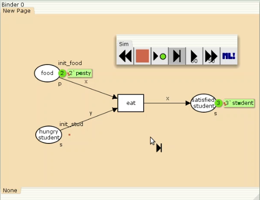
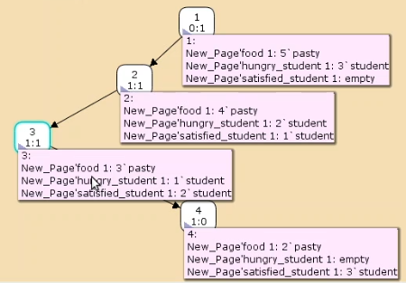

---
## Front matter
title: Лабораторная работа 9
subtitle: Модель "Накорми студентов"
author: Клюкин Михаил Александрович

## Generic otions
lang: ru-RU
toc-title: "Содержание"

## Bibliography
bibliography: bib/cite.bib
csl: pandoc/csl/gost-r-7-0-5-2008-numeric.csl

## Pdf output format
toc: true # Table of contents
toc-depth: 2
lof: true # List of figures
lot: true # List of tables
fontsize: 12pt
linestretch: 1.5
papersize: a4
documentclass: scrreprt
## I18n polyglossia
polyglossia-lang:
  name: russian
  options:
	- spelling=modern
	- babelshorthands=true
polyglossia-otherlangs:
  name: english
## I18n babel
babel-lang: russian
babel-otherlangs: english
## Fonts
mainfont: IBM Plex Serif
romanfont: IBM Plex Serif
sansfont: IBM Plex Sans
monofont: IBM Plex Mono
mathfont: STIX Two Math
mainfontoptions: Ligatures=Common,Ligatures=TeX,Scale=0.94
romanfontoptions: Ligatures=Common,Ligatures=TeX,Scale=0.94
sansfontoptions: Ligatures=Common,Ligatures=TeX,Scale=MatchLowercase,Scale=0.94
monofontoptions: Scale=MatchLowercase,Scale=0.94,FakeStretch=0.9
mathfontoptions:
## Biblatex
biblatex: true
biblio-style: "gost-numeric"
biblatexoptions:
  - parentracker=true
  - backend=biber
  - hyperref=auto
  - language=auto
  - autolang=other*
  - citestyle=gost-numeric
## Pandoc-crossref LaTeX customization
figureTitle: "Рис."
tableTitle: "Таблица"
listingTitle: "Листинг"
lofTitle: "Список иллюстраций"
lotTitle: "Список таблиц"
lolTitle: "Листинги"
## Misc options
indent: true
header-includes:
  - \usepackage{indentfirst}
  - \usepackage{float} # keep figures where there are in the text
  - \floatplacement{figure}{H} # keep figures where there are in the text
---

# Цель работы

Реализовать модель "Накорми студентов" в CPN Tools.

# Задание

1. Реализовать модель "Накорми студентов" в CPN Tools.
2. Вычислить пространство состояний, сформировать отчет, построить граф состояний.

# Выполнение работы

Рассмотрим пример студентов, которые обедают пирожками. Голодный студент становится сытым после того, как съедает пирог.

Таким образом, имеем:
- два типа фишек: "пироги" и "студенты";
- три позиции: "голодный студент", "пироги", "сытый студент";
- один переход: "съесть пирожок".

Нарисуем граф сети. Для этого создадим новую сеть, добавим позиции, переход и дуги (рис. [-@fig:001]).

{#fig:001 width=70%}

В меню задаем новые декларации модели: типы фишек, начальные значения, выражения для дуг (рис. [-@fig:002]).

{#fig:002 width=70%}

Задаем тип s фишкам, относящимся к студентам, тип p -- фишкам, относящимся к пирогам, задаем значения переменных x и y
для дуг и начальные значения мультимножеств `init_stud` и `init_food`.
Получаем готовую модель (рис. [-@fig:003]).

{#fig:003 width=70%}
 
После запуска фишки типа "пирожки" из позиции "еда" и фишки типа "студенты" из позиции "голодный студент",
пройдя через переход "поедание", попадают в позицию "сытый студент" и преобразуются в тип "студенты" (рис. [-@fig:004]).

{#fig:004 width=70%}

# Упражнение

Вычислим пространство состояний, сформируем отчет и проанализируем пространство состояний.

```
CPN Tools state space report for:
<unsaved net>
Report generated: Fri Apr  4 18:19:26 2025


 Statistics
------------------------------------------------------------------------

  State Space
     Nodes:  4
     Arcs:   3
     Secs:   0
     Status: Full

  Scc Graph
     Nodes:  4
     Arcs:   3
     Secs:   0


 Boundedness Properties
------------------------------------------------------------------------

  Best Integer Bounds
                             Upper      Lower
     New_Page'food 1         5          2
     New_Page'hungry_student 1
                             3          0
     New_Page'satisfied_student 1
                             3          0

  Best Upper Multi-set Bounds
     New_Page'food 1     5`pasty
     New_Page'hungry_student 1
                         3`student
     New_Page'satisfied_student 1
                         3`student

  Best Lower Multi-set Bounds
     New_Page'food 1     2`pasty
     New_Page'hungry_student 1
                         empty
     New_Page'satisfied_student 1
                         empty


 Home Properties
------------------------------------------------------------------------

  Home Markings
     [4]


 Liveness Properties
------------------------------------------------------------------------

  Dead Markings
     [4]

  Dead Transition Instances
     None

  Live Transition Instances
     None


 Fairness Properties
------------------------------------------------------------------------
     No infinite occurrence sequences.

```

Из отчета получим, что 

- в графе есть 4 узла и 3 дуги, то есть 4 состояния и 3 перехода;
- указаны границы значений для каждого элемента: 
  - голодные студенты (максимум 3, минимум 0),
  - сытые студенты (максимум 3, минимум 0),
  - еда (максимум 5, минимум 2, минимальное значение равно 2, поскольку в конце симуляции остаются пирожки);
- указаны границы мультимножеств;
- маркировка home равна 4;
- маркировка dead равна 4;
- указано, что нет бесконечных последовательностей вхождений.

Построим граф пространства состояний (рис. [-@fig:005]).

{#fig:005 width=70%}

# Выводы

В результате выполнения лабораторной работы реализовали модель "Накорми студентов" в CPN Tools.

# Список литературы{.unnumbered}

::: {#refs}
:::
