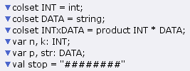
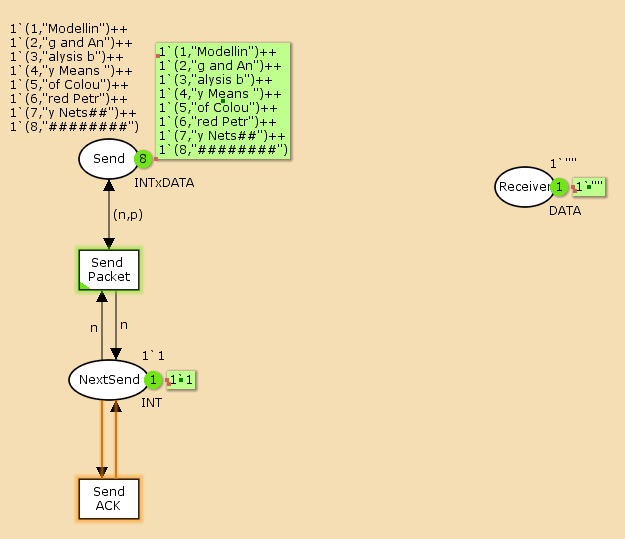
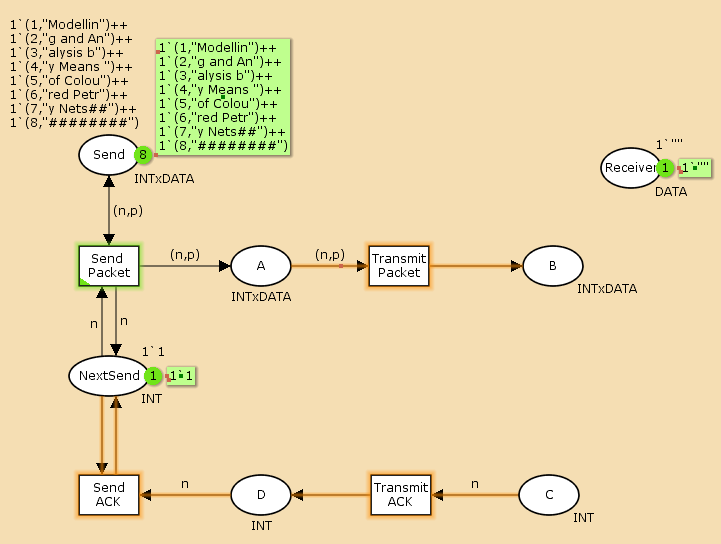
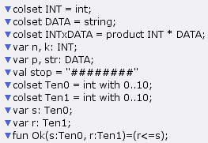
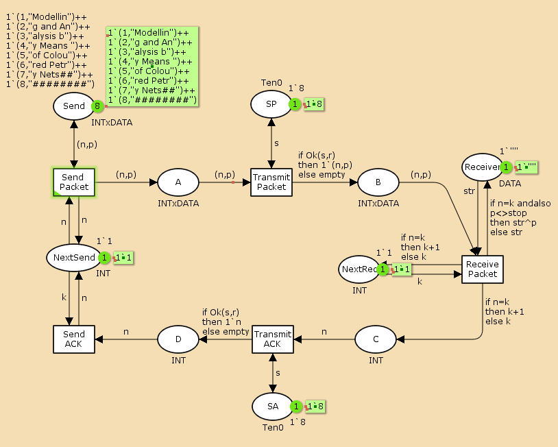
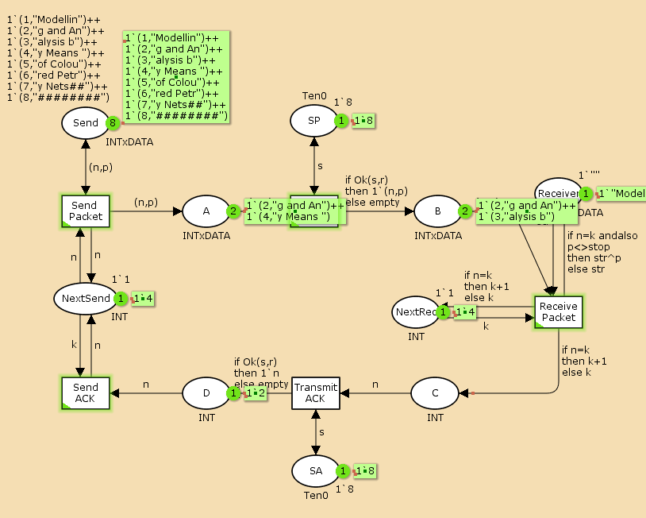
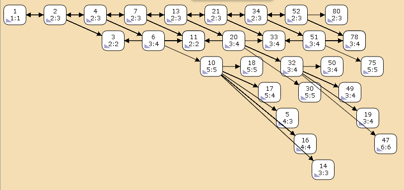

---
## Front matter
lang: ru-RU
title: Лабораторная работа №12
subtitle: Пример моделирования простого протокола передачи данных
author:
  - Клюкин М. А.
institute:
  - Российский университет дружбы народов, Москва, Россия
  

## i18n babel
babel-lang: russian
babel-otherlangs: english

## Formatting pdf
toc: false
toc-title: Содержание
slide_level: 2
aspectratio: 169
section-titles: true
theme: metropolis
header-includes:
 - \metroset{progressbar=frametitle,sectionpage=progressbar,numbering=fraction}
 - \usepackage{fontspec}
 - \usepackage{polyglossia}
 - \setmainlanguage{russian}
 - \setotherlanguage{english}
 - \newfontfamily\cyrillicfont{Arial}
 - \newfontfamily\cyrillicfontsf{Arial}
 - \newfontfamily\cyrillicfonttt{Arial}
 - \setmainfont{Arial}
 - \setsansfont{Arial}
 
---


## Докладчик

:::::::::::::: {.columns align=center}
::: {.column width="70%"}

  * Клюкин Михаил Александрович
  * студент
  * Российский университет дружбы народов
  * [1132226431@pruf.ru](mailto:1132226431@pfur.ru)
  * <https://MaKYaro.github.io/ru/>

:::
::: {.column width="30%"}


:::
::::::::::::::

## Цель работы

Реализовать простой протокол передачи данных в CPN Tools.

## Задание

1. Реализовать простой протокол передачи данных в CPN Tools.
2. Вычислить пространство состояний, сформировать отчет о нем и построить граф.

## Выполнение лабораторной работы

{#fig:001 width=70%}

## Выполнение лабораторной работы

{#fig:002 width=60%}

## Выполнение лабораторной работы

{#fig:003 width=60%}

## Выполнение лабораторной работы

{#fig:004 width=70%}

## Выполнение лабораторной работы

{#fig:005 width=60%}

## Выполнение лабораторной работы

{#fig:006 width=60%}

## Упражнение

```
 Statistics
------------------------------------------------------------------------

  State Space
     Nodes:  11109
     Arcs:   167988
     Secs:   300
     Status: Partial

  Scc Graph
     Nodes:  5833
     Arcs:   138605
     Secs:   32
```

## Упражнение

```
 Boundedness Properties
------------------------------------------------------------------------

  Best Integer Bounds
                             Upper      Lower
     Net'A 1                 19         0
     Net'B 1                 9          0
     Net'C 1                 6          0
     Net'D 1                 5          0
     Net'NextRec 1           1          1
     Net'NextSend 1          1          1
     Net'Receiver 1          1          1
     Net'SA 1                1          1
     Net'SP 1                1          1
     Net'Send 1              8          8
```

## Упражнение

{#fig:007 width=60%}

## Выводы

В процессе выполнения лабораторной работы реализовали простой протокол передачи данных в CPN Tools, провели анализ его пространства состояний.

