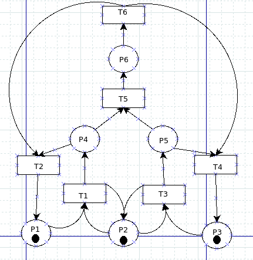
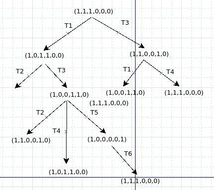
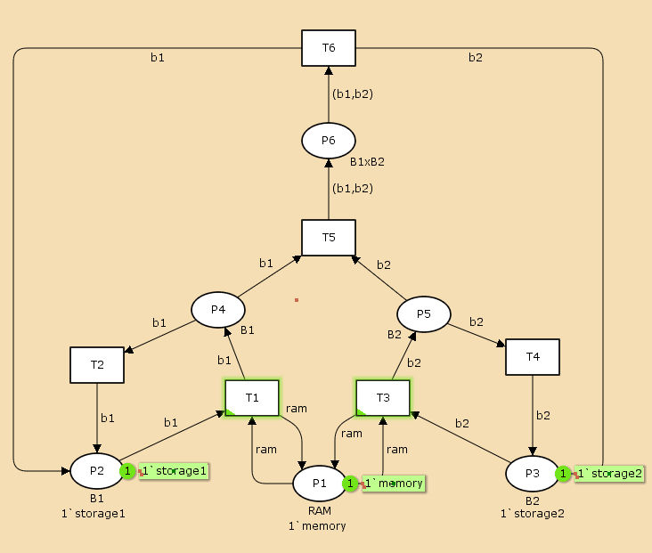
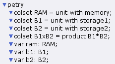
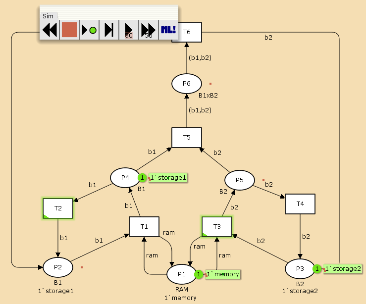
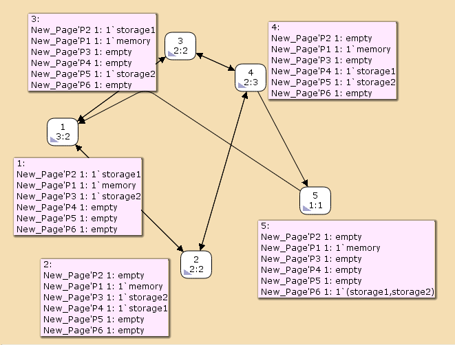

---
## Front matter
lang: ru-RU
title: Лабораторная работа №13
subtitle: Задание для самостоятельного выполнения
author:
  - Клюкин М. А.
institute:
  - Российский университет дружбы народов, Москва, Россия
  

## i18n babel
babel-lang: russian
babel-otherlangs: english

## Formatting pdf
toc: false
toc-title: Содержание
slide_level: 2
aspectratio: 169
section-titles: true
theme: metropolis
header-includes:
 - \metroset{progressbar=frametitle,sectionpage=progressbar,numbering=fraction}
 - \usepackage{fontspec}
 - \usepackage{polyglossia}
 - \setmainlanguage{russian}
 - \setotherlanguage{english}
 - \newfontfamily\cyrillicfont{Arial}
 - \newfontfamily\cyrillicfontsf{Arial}
 - \newfontfamily\cyrillicfonttt{Arial}
 - \setmainfont{Arial}
 - \setsansfont{Arial}
 
---


## Докладчик

:::::::::::::: {.columns align=center}
::: {.column width="70%"}

  * Клюкин Михаил Александрович
  * студент
  * Российский университет дружбы народов
  * [1132226431@pruf.ru](mailto:1132226431@pfur.ru)
  * <https://MaKYaro.github.io/ru/>

:::
::: {.column width="30%"}


:::
::::::::::::::

## Цель работы

Выполнить задание для самостоятельного выполнения.

## Задание

1. Используя теоретические методы анализа сетей Петри, провести анализ сети с помощью построения дерева достижимости. Определить, является ли сеть безопасной, ограниченной, сохраняющей, имеются ли тупики.
2. Промоделировать сеть Петри с помощью CPNTools.
3. Вычислить пространство состояний. Сформировать отчёт о пространстве состояний и проанализируйте его. Постротьб граф пространства состояний.

## Описание модели

{#fig:001 width=40%}

## Анализ сети Петри

{#fig:002 width=50%}

## Реализация модели в CPNTools

{#fig:003 width=50%}

## Реализация модели в CPNTools

{#fig:004 width=70%}

## Реализация модели в CPNTools

{#fig:005 width=55%}

## Пространство состояний

```
  State Space
     Nodes:  5
     Arcs:   10
     Secs:   0
     Status: Full

  Scc Graph
     Nodes:  1
     Arcs:   0
     Secs:   0

```

## Пространство состояний

{#fig:006 width=60%}

## Выводы

Выполнили задание для самостоятельного выполнения.
