---
## Front matter
lang: ru-RU
title: Лабораторная работа №14
subtitle: Модели обработки заказов
author:
  - Клюкин М. А.
institute:
  - Российский университет дружбы народов, Москва, Россия
  

## i18n babel
babel-lang: russian
babel-otherlangs: english

## Formatting pdf
toc: false
toc-title: Содержание
slide_level: 2
aspectratio: 169
section-titles: true
theme: metropolis
header-includes:
 - \metroset{progressbar=frametitle,sectionpage=progressbar,numbering=fraction}
 - \usepackage{fontspec}
 - \usepackage{polyglossia}
 - \setmainlanguage{russian}
 - \setotherlanguage{english}
 - \newfontfamily\cyrillicfont{Arial}
 - \newfontfamily\cyrillicfontsf{Arial}
 - \newfontfamily\cyrillicfonttt{Arial}
 - \setmainfont{Arial}
 - \setsansfont{Arial}
 
---

## Докладчик

:::::::::::::: {.columns align=center}
::: {.column width="70%"}

  * Клюкин Михаил Александрович
  * студент
  * Российский университет дружбы народов
  * [1132226431@pruf.ru](mailto:1132226431@pfur.ru)
  * <https://MaKYaro.github.io/ru/>

:::
::: {.column width="30%"}

:::
::::::::::::::

## Цель работы

Реализовать модель обработки заказов и провести анализ результатов.

## Задание

Реализовать с помощью gpss:

- модель оформления заказов клиентов одним оператором;
- построение гистограммы распределения заявок в очереди;
- модель обслуживания двух типов заказов от клиентов в интернет-магазине;
- модель оформления заказов несколькими операторами;

# Выполнение лабораторной работы

## Модель оформления заказов клиентов одним оператором

1) клиент оставляет заявку на заказ в интернет-магазине;   
2) если необходимо, заявка от клиента ожидает в очереди освобождения оператора для оформления заказа;   
3) заявка от клиента принимается оператором для оформления заказа;    
4) оператор оформляет заказ;   
5) клиент получает подтверждение об оформлении заказа (покидает систему).   

## Модель оформления заказов клиентов одним оператором

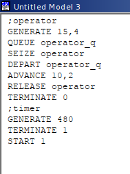{#fig:001 width=50%}

## Модель оформления заказов клиентов одним оператором

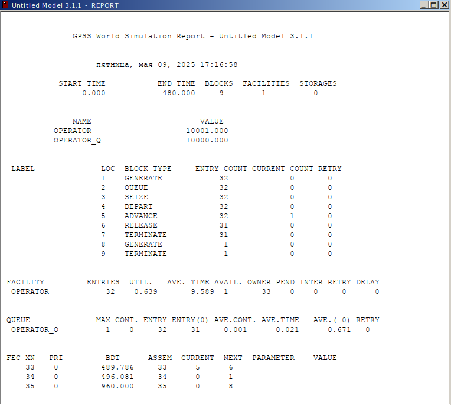{#fig:002 width=50%}

## Модель оформления заказов клиентов одним оператором

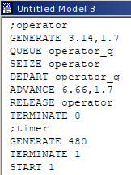{#fig:003 width=50%}

## Модель оформления заказов клиентов одним оператором

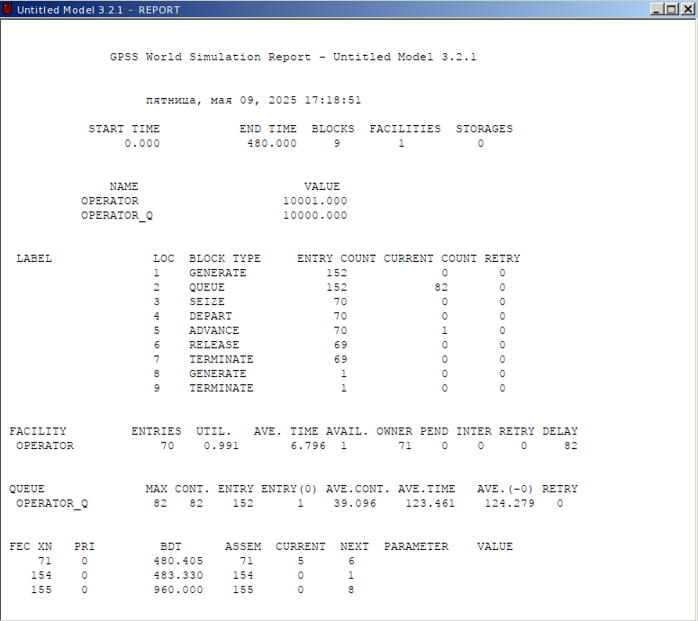{#fig:004 width=50%}

## Построение гистограммы распределения заявок в очереди

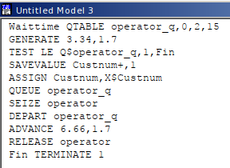{#fig:005 width=50%}

## Построение гистограммы распределения заявок в очереди

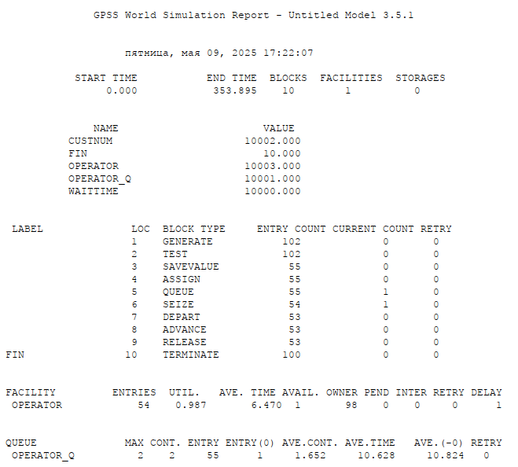{#fig:006 width=50%}

## Построение гистограммы распределения заявок в очереди

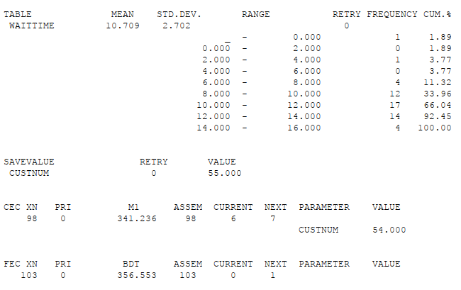{#fig:007 width=50%}

## Построение гистограммы распределения заявок в очереди

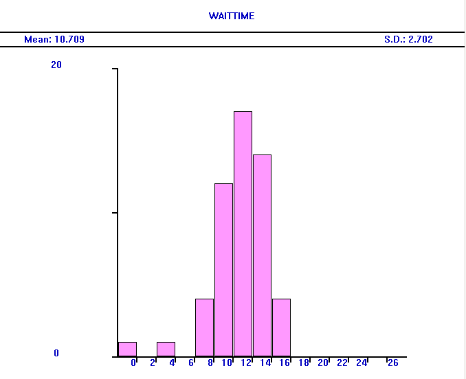{#fig:008 width=50%}

## Модель обслуживания двух типов заказов от клиентов в интернет-магазине

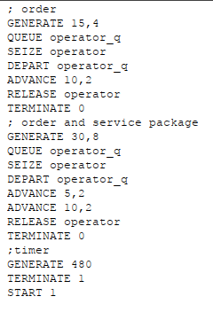{#fig:009 width=40%}

## Модель обслуживания двух типов заказов от клиентов в интернет-магазине

{#fig:010 width=40%}

## Модель обслуживания двух типов заказов от клиентов в интернет-магазине

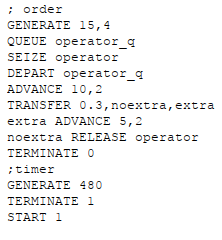{#fig:011 width=40%}

## Модель обслуживания двух типов заказов от клиентов в интернет-магазине

{#fig:012 width=40%}

## Модель оформления заказов несколькими операторами

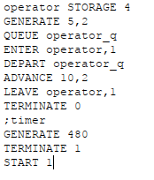{#fig:013 width=40%}

## Модель оформления заказов несколькими операторами

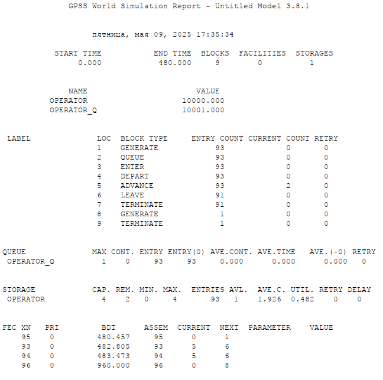{#fig:014 width=50%}

## Модель оформления заказов несколькими операторами

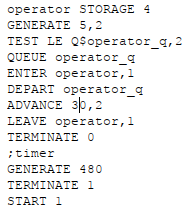{#fig:015 width=40%}

## Модель оформления заказов несколькими операторами

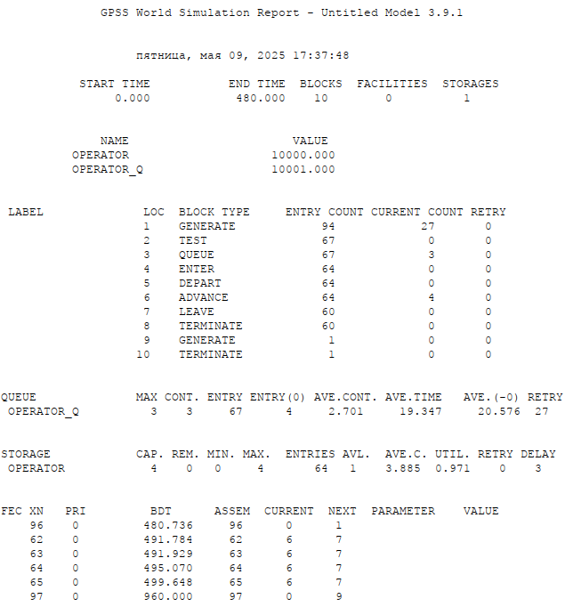{#fig:016 width=40%}

## Выводы

В результате была реализована с помощью gpss:

- модель оформления заказов клиентов одним оператором;
- построение гистограммы распределения заявок в очереди;
- модель обслуживания двух типов заказов от клиентов в интернет-магазине;
- модель оформления заказов несколькими операторами.

