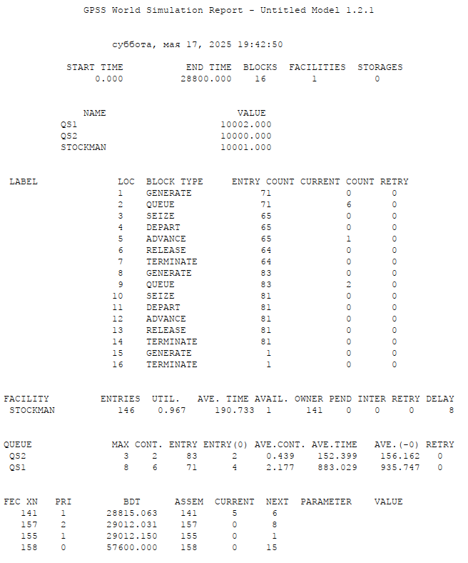
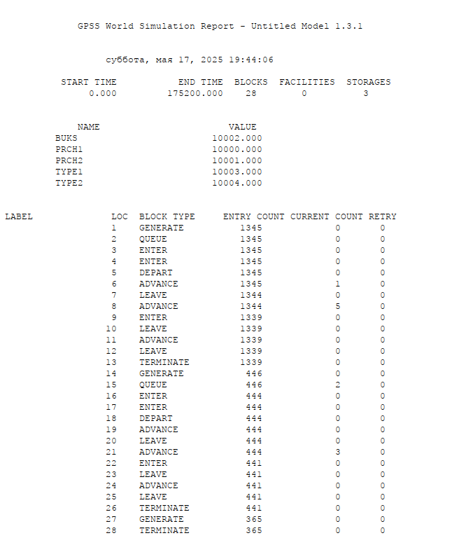
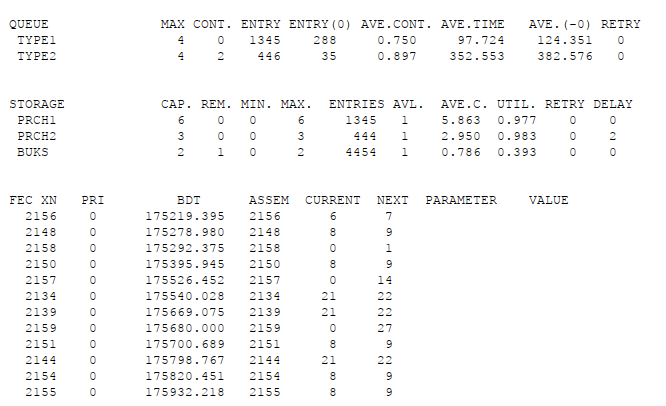

---
## Front matter
lang: ru-RU
title: Лабораторная работа №15
subtitle: Модели обслуживания с приоритетами
author:
  - Клюкин М. А.
institute:
  - Российский университет дружбы народов, Москва, Россия
  

## i18n babel
babel-lang: russian
babel-otherlangs: english

## Formatting pdf
toc: false
toc-title: Содержание
slide_level: 2
aspectratio: 169
section-titles: true
theme: metropolis
header-includes:
 - \metroset{progressbar=frametitle,sectionpage=progressbar,numbering=fraction}
 - \usepackage{fontspec}
 - \usepackage{polyglossia}
 - \setmainlanguage{russian}
 - \setotherlanguage{english}
 - \newfontfamily\cyrillicfont{Arial}
 - \newfontfamily\cyrillicfontsf{Arial}
 - \newfontfamily\cyrillicfonttt{Arial}
 - \setmainfont{Arial}
 - \setsansfont{Arial}
 
---


## Докладчик

:::::::::::::: {.columns align=center}
::: {.column width="70%"}

  * Клюкин Михаил Александрович
  * студент
  * Российский университет дружбы народов
  * [1132226431@pruf.ru](mailto:1132226431@pfur.ru)
  * <https://MaKYaro.github.io/ru/>

:::
::: {.column width="30%"}


:::
::::::::::::::

## Цель работы

Реализовать модель обслуживания с приоритетами и провести анализ результатов.

## Задание

С помощью ПО gpss реализовать:

- Модель обслуживания механиков на складе
- Модель обслуживания судов двух типов в порту


# Выполнение лабораторной работы

## Модель обслуживания механиков на складе

```
; type 1
GENERATE 420,360,,,1
QUEUE qs1
SEIZE stockman
DEPART qs1
ADVANCE 300,90
RELEASE stockman
TERMINATE 0
```

## Модель обслуживания механиков на складе

```
; type 2
GENERATE 360,240,,,2
QUEUE qs2
SEIZE stockman
DEPART qs2
ADVANCE 100,30
RELEASE stockman
TERMINATE 0
```

## Модель обслуживания механиков на складе

```
;timer
GENERATE 28800
TERMINATE 1
START 1
```

## Модель обслуживания механиков на складе

{#fig:001 width=40%}

## Модель обслуживания в порту судов двух типов

```
prch1 STORAGE 6 ; 6 причалов для кораблей 1 типа
prch2 STORAGE 3 ; 3 причала для кораблей 2 типа
buks STORAGE 2 ; 2 буксира
```

## Модель обслуживания в порту судов двух типов

```
; ships of type 1
GENERATE 130,30 ; подход к порту
QUEUE type1
ENTER prch1 ; получение причала
ENTER buks ; получение буксира
DEPART type1 ;
ADVANCE 30,7 ; буксирование до причала
LEAVE buks ; освобождение буксира
ADVANCE 720,120 ; погрузка / разгрузка
ENTER buks ; получение буксира
LEAVE prch1 ; освобождение причала
ADVANCE 20,5 ; буксирование (отчаливание)
LEAVE buks ; освобождение буксира
TERMINATE
```

## Модель обслуживания в порту судов двух типов

```
; ships of type 2
GENERATE 390,60 ; подход к порту
QUEUE type2
ENTER prch2 ; получение причала
ENTER buks,2 ; получение 2-х буксиров
DEPART type2 ;
ADVANCE 45,12 ; буксирование до причала
LEAVE buks,2 ; освобождение буксиров
ADVANCE 1080,240; погрузка / разгрузка
ENTER buks,2 ; получение 2-х буксиров
LEAVE prch2 ; освобождение причала
ADVANCE 35,10 ; буксирование (отчаливание)
LEAVE buks,2 ; освобождение буксира
TERMINATE 0
```

## Модель обслуживания в порту судов двух типов

```
;timer
GENERATE 480 ; 8 часов рабочего дня
TERMINATE 1
START 365 ; число дней моделирования
```

## Модель обслуживания в порту судов двух типов

{#fig:002 width=40%}

## Модель обслуживания в порту судов двух типов

{#fig:003 width=70%}


## Выводы

В результате выполнения работы были реализованы с помощью gpss:

- Модель обслуживания механиков на складе;
- Модель обслуживания в порту судов двух типов.