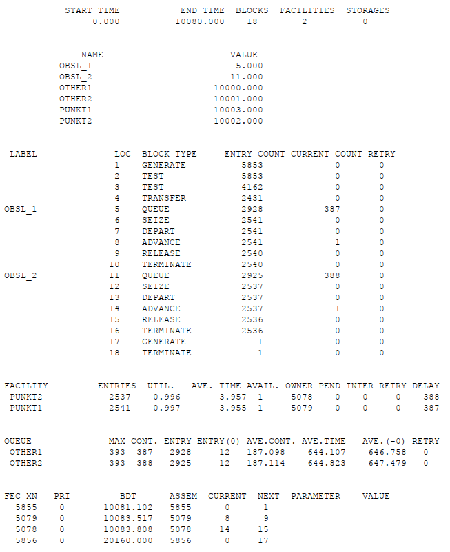
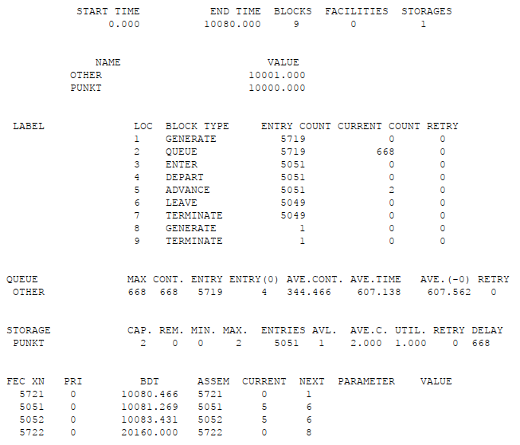
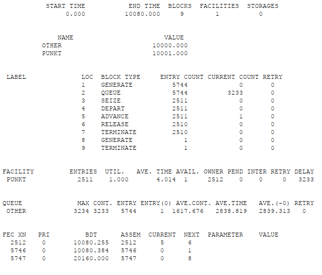
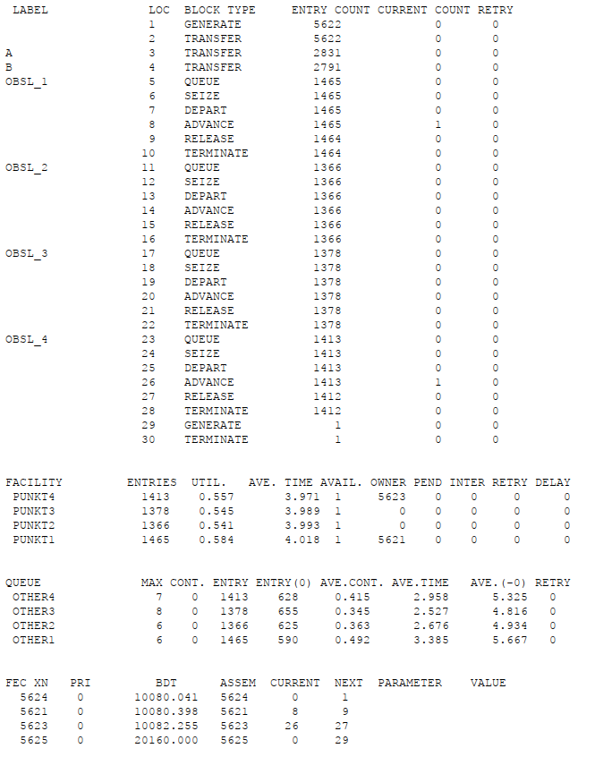
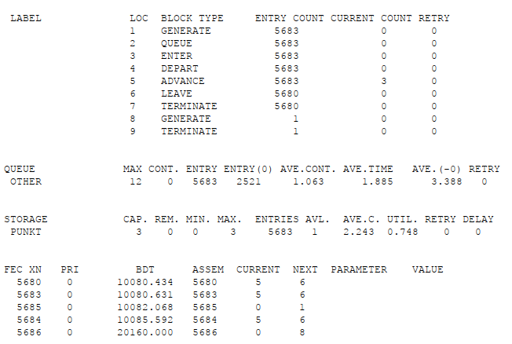
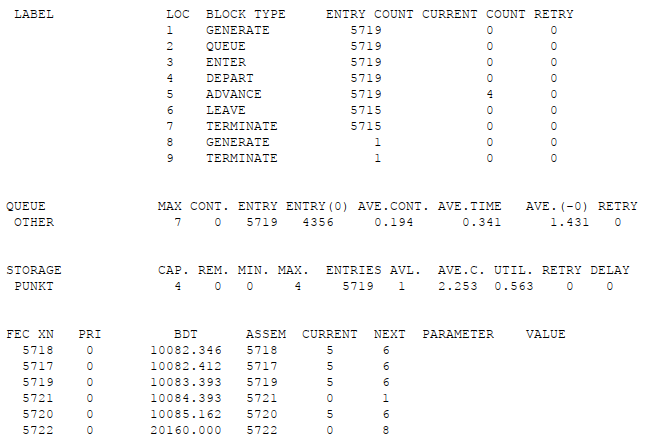

---
## Front matter
lang: ru-RU
title: Лабораторная работа №16
subtitle: Задачи оптимизации. Модель двух стратегий обслуживания
author:
  - Клюкин М. А.
institute:
  - Российский университет дружбы народов, Москва, Россия
  

## i18n babel
babel-lang: russian
babel-otherlangs: english

## Formatting pdf
toc: false
toc-title: Содержание
slide_level: 2
aspectratio: 169
section-titles: true
theme: metropolis
header-includes:
 - \metroset{progressbar=frametitle,sectionpage=progressbar,numbering=fraction}
 - \usepackage{fontspec}
 - \usepackage{polyglossia}
 - \setmainlanguage{russian}
 - \setotherlanguage{english}
 - \newfontfamily\cyrillicfont{Arial}
 - \newfontfamily\cyrillicfontsf{Arial}
 - \newfontfamily\cyrillicfonttt{Arial}
 - \setmainfont{Arial}
 - \setsansfont{Arial}
 
---


## Докладчик

:::::::::::::: {.columns align=center}
::: {.column width="70%"}

  * Клюкин Михаил Александрович
  * студент
  * Российский университет дружбы народов
  * [1132226431@pruf.ru](mailto:1132226431@pfur.ru)
  * <https://MaKYaro.github.io/ru/>

:::
::: {.column width="30%"}


:::
::::::::::::::

## Цель работы

Реализовать с помощью gpss модель двух стратегий обслуживания и оценить оптимальные параметры.

## Задание

Реализовать с помощью gpss: 

- модель с двумя очередями;
- модель с одной очередью;
- определить оптимальное число пропускных пунктов.

# Выполнение лабораторной работы

## Постановка задачи


1. автомобили образуют две очереди и обслуживаются соответствующими пунктами пропуска;
2. автомобили образуют одну общую очередь и обслуживаются освободившимся пунктом пропуска.   

Исходные данные: $ \mu = 1,75$ мин, $a = 1$ мин, $b = 7$ мин.

## Построение модели

```
GENERATE (Exponential(1,0,1.75)) ; прибытие автомобилей
TEST LE Q$Other1,Q$Other2,Obsl_2 ; длина оч. 1<= длине оч. 2
TEST E Q$Other1,Q$Other2,Obsl_1 ; длина оч. 1= длине оч. 2
TRANSFER 0.5,Obsl_1,Obsl_2 ; длины очередей равны,
```

## Построение модели

```
; выбираем произв. пункт пропуска
; моделирование работы пункта 1
Obsl_1 QUEUE Other1 ; присоединение к очереди 1
SEIZE punkt1 ; занятие пункта 1
DEPART Other1 ; выход из очереди 1
ADVANCE 4,3 ; обслуживание на пункте 1
RELEASE punkt1 ; освобождение пункта 1
TERMINATE ; автомобиль покидает систему
```

## Построение модели

```
; моделирование работы пункта 2
Obsl_2 QUEUE Other2 ; присоединение к очереди 2
SEIZE punkt2 ; занятие пункта 2
DEPART Other2 ; выход из очереди 2
ADVANCE 4,3 ; обслуживание на пункте 2
RELEASE punkt2 ; освобождение пункта 2
TERMINATE ; автомобиль покидает систему
```

## Построение модели

```
; задание условия остановки процедуры моделирования
GENERATE 10080 ; генерация фиктивного транзакта,
; указывающего на окончание рабочей недели
; (7 дней x 24 часа x 60 мин = 10080 мин)
TERMINATE 1 ; остановить моделирование
START 1 ; запуск процедуры моделирования
```

## Построение модели

{#fig:001 width=40%}

## Построение модели

```
punkt STORAGE 2
GENERATE (Exponential(1,0,1.75)) ; прибытие автомобиля

QUEUE Other ; присоединение к очереди 1
ENTER punkt,1 ; занятие пункта 1
DEPART Other ; выход из очереди 1
ADVANCE 4,3 ; обслуживание на пункте 1
LEAVE punkt,1 ; освобождение пункта 1
TERMINATE ; автомобиль покидает систему
```

## Построение модели

```
; задание условия остановки процедуры моделирования
GENERATE 10080 ; генерация фиктивного транзакта,
; указывающего на окончание рабочей недели
; (7 дней х 24 часа х 60 мин = 10080 мин)
TERMINATE 1 ; остановить моделирование
START 1 ; запуск процедуры моделирования
```

## Построение модели

{#fig:002 width=50%}

## Построение модели

: Сравнение стратегий {#tbl:strategy}:

| Показатель                 | стратегия 1 |         |          |  стратегия 2 |
|----------------------------|-------------|---------|----------|--------------|
|                            | пункт 1     | пункт 2 | в целом  |              |
| Поступило автомобилей      | 2928        | 2925    | 5853     | 5719         |
| Обслужено автомобилей      | 2540        | 2536    | 5076     | 5049         |
| Коэффициент загрузки       | 0,997       | 0,996   | 0,9965   | 1            |
| Максимальная длина очереди | 393         | 393     | 786      | 668          |
| Средняя длина очереди      | 187,098     | 187,114 | 374,212  | 344,466      |
| Среднее время ожидания     | 644,107     | 644,823 | 644,465  | 607,138      |


## Оптимизация модели двух стратегий обслуживания

- коэффициент загрузки пропускных пунктов находится в интервале $[0.5; 0.95]$;
- среднее число автомобилей, одновременно находящихся на контрольно-пропускном пункте, не должно превышать 3;
- среднее время ожидания обслуживания не должно превышать 4 минут.

## Оптимизация модели двух стратегий обслуживания

```
GENERATE (Exponential(1,0,1.75)) ;

QUEUE Other ;
SEIZE punkt ;
DEPART Other ;
ADVANCE 4,3 ;
RELEASE punkt ;
TERMINATE ;

GENERATE 10080 ;
TERMINATE 1 ;
START 1 ;
```

## Оптимизация модели двух стратегий обслуживания

{#fig:003 width=50%}

## Оптимизация модели двух стратегий обслуживания

```
GENERATE (Exponential(1,0,1.75)) ; 

TRANSFER 0.33,go,Obsl_3;
go TRANSFER 0.5,Obsl_1,Obsl_2 ; 

Obsl_1 QUEUE Other1 ; 
SEIZE punkt1 ;  
DEPART Other1 ; 
ADVANCE 4,3 ;
RELEASE punkt1 ;
TERMINATE ;
```

## Оптимизация модели двух стратегий обслуживания

```
Obsl_2 QUEUE Other2 ; 
SEIZE punkt2 ;  
DEPART Other2 ; 
ADVANCE 4,3 ;
RELEASE punkt2 ;
TERMINATE ;
```

## Оптимизация модели двух стратегий обслуживания

```

Obsl_3 QUEUE Other3 ; 
SEIZE punkt3 ;  
DEPART Other3 ; 
ADVANCE 4,3 ;
RELEASE punkt3 ;
TERMINATE ;

GENERATE 10080 ;
TERMINATE 1 ;
START 1 ;
```

## Оптимизация модели двух стратегий обслуживания

{#fig:004 width=40%}

## Оптимизация модели двух стратегий обслуживания

```
GENERATE (Exponential(1,0,1.75)) ; 

TRANSFER 0.5,a,b;
a TRANSFER 0.5,Obsl_1,Obsl_2
b TRANSFER 0.5,Obsl_3,Obsl_4

Obsl_1 QUEUE Other1 ; 
SEIZE punkt1 ;  
DEPART Other1 ; 
ADVANCE 4,3 ;
RELEASE punkt1 ;
TERMINATE ;
```

## Оптимизация модели двух стратегий обслуживания

```
Obsl_2 QUEUE Other2 ; 
SEIZE punkt2 ;  
DEPART Other2 ; 
ADVANCE 4,3 ;
RELEASE punkt2 ;
TERMINATE ;

Obsl_3 QUEUE Other3 ; 
SEIZE punkt3 ;  
DEPART Other3 ; 
ADVANCE 4,3 ;
RELEASE punkt3 ;
TERMINATE ;
```

## Оптимизация модели двух стратегий обслуживания

```
Obsl_4 QUEUE Other4 ; 
SEIZE punkt4 ;  
DEPART Other4 ; 
ADVANCE 4,3 ;
RELEASE punkt4 ;
TERMINATE ;


GENERATE 10080 ;
TERMINATE 1 ;
START 1 ;
```

## Оптимизация модели двух стратегий обслуживания

{#fig:005 width=40%}

## Оптимизация модели двух стратегий обслуживания

```
punkt STORAGE 3;
GENERATE (Exponential(1,0,1.75))

QUEUE Other ;
ENTER punkt ;
DEPART Other ;
ADVANCE 4,3 ;
LEAVE punkt ;
TERMINATE ;

GENERATE 10080 ;
TERMINATE 1 ;
START 1 ;
```

## Оптимизация модели двух стратегий обслуживания

{#fig:006 width=70%}

## Оптимизация модели двух стратегий обслуживания

```
punkt STORAGE 4;
GENERATE (Exponential(1,0,1.75))

QUEUE Other ;
ENTER punkt ;
DEPART Other ;
ADVANCE 4,3 ;
LEAVE punkt ;
TERMINATE ;

GENERATE 10080 ;
TERMINATE 1 ;
START 1 ;
```

## Оптимизация модели двух стратегий обслуживания

{#fig:007 width=70%}

# Выводы

В результате выполнения лабораторной работы реализовали с помощью gpss:

- модель с двумя очередями 
- модель с одной очередью
- определили оптимальное число пропускных пунктов.

