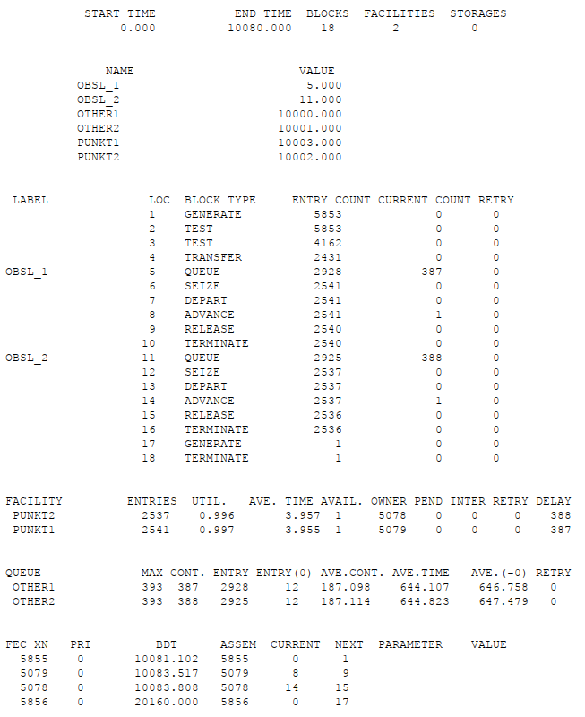
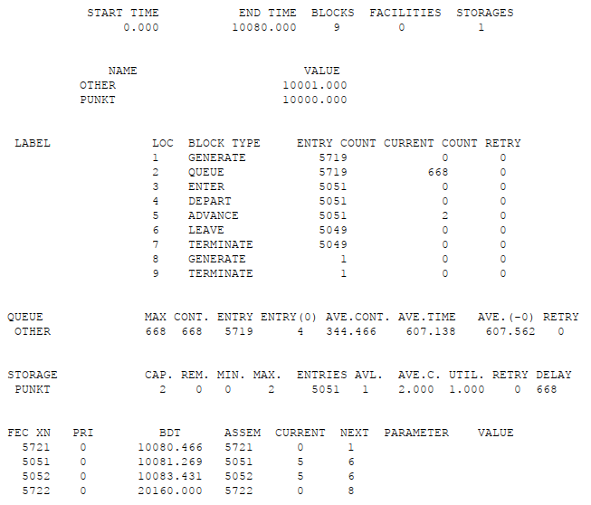
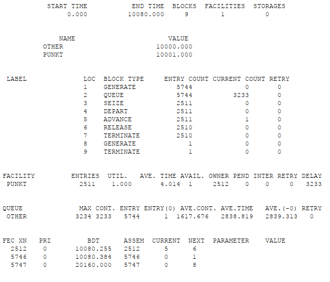
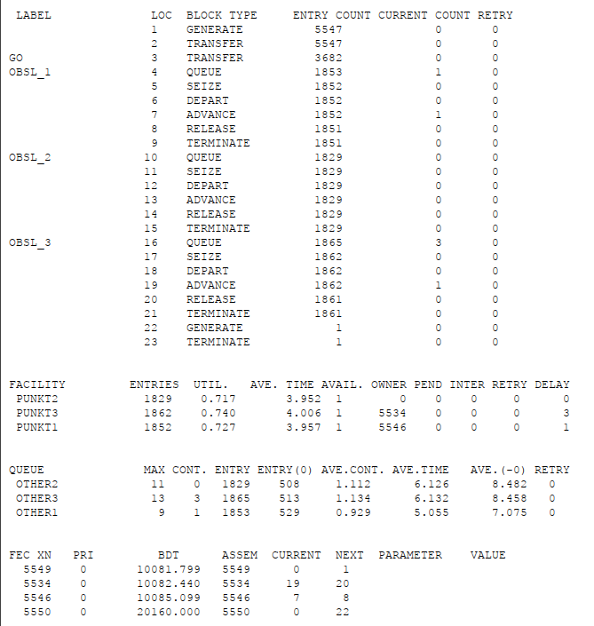
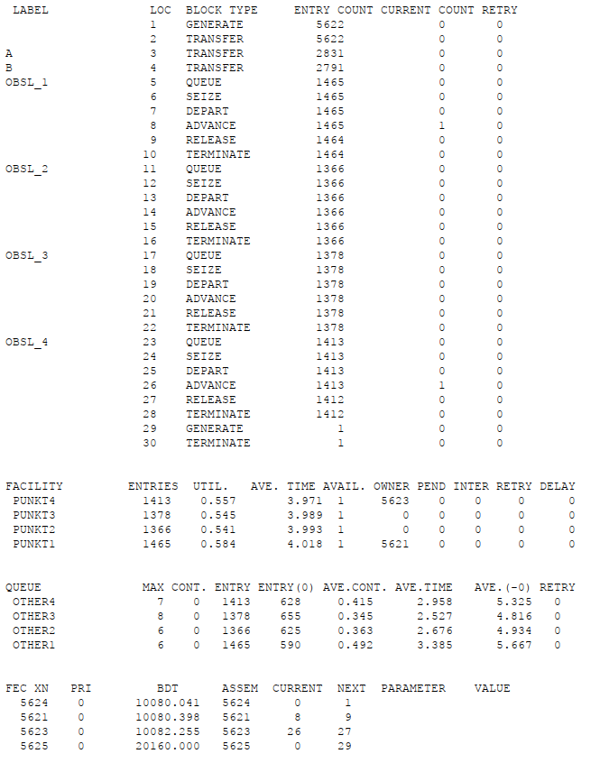
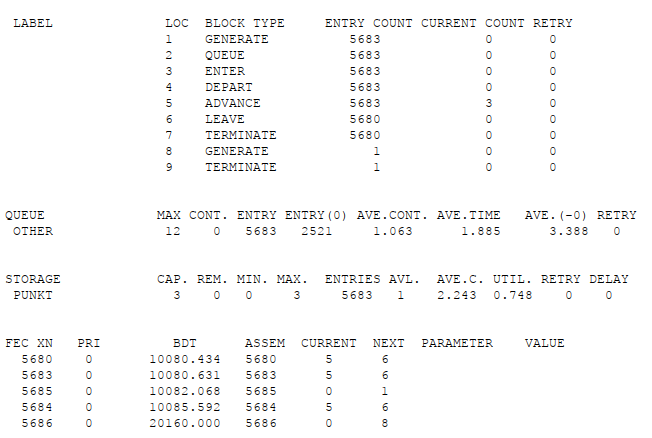
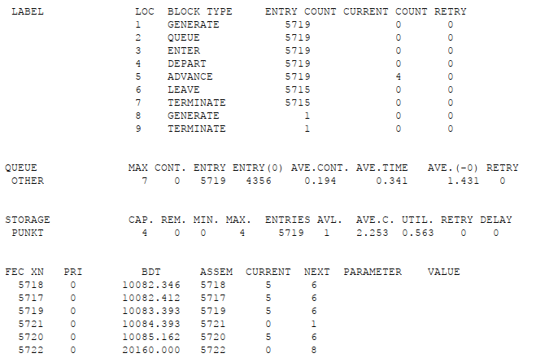

---
## Front matter
title: "Лабораторная работа №16"
subtitle: "Задачи оптимизации. Модель двух стратегий обслуживания"
author: "Клюкин Михаил Александрович"

## Generic otions
lang: ru-RU
toc-title: "Содержание"

## Bibliography
bibliography: bib/cite.bib
csl: pandoc/csl/gost-r-7-0-5-2008-numeric.csl

## Pdf output format
toc: true # Table of contents
toc-depth: 2
lof: true # List of figures
lot: true # List of tables
fontsize: 12pt
linestretch: 1.5
papersize: a4
documentclass: scrreprt
## I18n polyglossia
polyglossia-lang:
  name: russian
  options:
	- spelling=modern
	- babelshorthands=true
polyglossia-otherlangs:
  name: english
## I18n babel
babel-lang: russian
babel-otherlangs: english
## Fonts
mainfont: IBM Plex Serif
romanfont: IBM Plex Serif
sansfont: IBM Plex Sans
monofont: IBM Plex Mono
mathfont: STIX Two Math
mainfontoptions: Ligatures=Common,Ligatures=TeX,Scale=0.94
romanfontoptions: Ligatures=Common,Ligatures=TeX,Scale=0.94
sansfontoptions: Ligatures=Common,Ligatures=TeX,Scale=MatchLowercase,Scale=0.94
monofontoptions: Scale=MatchLowercase,Scale=0.94,FakeStretch=0.9
mathfontoptions:
## Biblatex
biblatex: true
biblio-style: "gost-numeric"
biblatexoptions:
  - parentracker=true
  - backend=biber
  - hyperref=auto
  - language=auto
  - autolang=other*
  - citestyle=gost-numeric
## Pandoc-crossref LaTeX customization
figureTitle: "Рис."
tableTitle: "Таблица"
listingTitle: "Листинг"
lofTitle: "Список иллюстраций"
lotTitle: "Список таблиц"
lolTitle: "Листинги"
## Misc options
indent: true
header-includes:
  - \usepackage{indentfirst}
  - \usepackage{float} # keep figures where there are in the text
  - \floatplacement{figure}{H} # keep figures where there are in the text
---

# Цель работы

Реализовать с помощью gpss модель двух стратегий обслуживания и оценить оптимальные параметры.

# Задание

Реализовать с помощью gpss: 

- модель с двумя очередями;
- модель с одной очередью;
- определить оптимальное число пропускных пунктов.

# Выполнение лабораторной работы

## Постановка задачи

На пограничном контрольно-пропускном пункте транспорта имеются 2 пункта пропуска. Интервалы времени между поступлением автомобилей имеют экспоненциальное распределение со средним значением $\mu$. Время прохождения автомобилями пограничного контроля имеет равномерное распределение на интервале [a, b]. Предлагается две стратегии обслуживания прибывающих автомобилей:   

1. автомобили образуют две очереди и обслуживаются соответствующими пунктами пропуска;
2. автомобили образуют одну общую очередь и обслуживаются освободившимся пунктом пропуска.   

Исходные данные: $ \mu = 1,75$ мин, $a = 1$ мин, $b = 7$ мин.

## Построение модели

Целью моделирования является определение:    

- характеристик качества обслуживания автомобилей, в частности, средних длин очередей; среднего времени обслуживания автомобиля; среднего времени пребывания автомобиля на пункте пропуска;
- наилучшей стратегии обслуживания автомобилей на пункте пограничного контроля;
- оптимального количества пропускных пунктов.    

В качестве критериев, используемых для сравнения стратегий обслуживания автомобилей, выберем:   

- коэффициенты загрузки системы;
- максимальные и средние длины очередей;
- средние значения времени ожидания обслуживания.    

Для первой стратегии обслуживания, когда прибывающие автомобили образуют две очереди и обслуживаются соответствующими пропускными пунктами, имеем следующую модель:

```
GENERATE (Exponential(1,0,1.75)) ; прибытие автомобилей
TEST LE Q$Other1,Q$Other2,Obsl_2 ; длина оч. 1<= длине оч. 2
TEST E Q$Other1,Q$Other2,Obsl_1 ; длина оч. 1= длине оч. 2
TRANSFER 0.5,Obsl_1,Obsl_2 ; длины очередей равны,
; выбираем произв. пункт пропуска
; моделирование работы пункта 1
Obsl_1 QUEUE Other1 ; присоединение к очереди 1
SEIZE punkt1 ; занятие пункта 1
DEPART Other1 ; выход из очереди 1
ADVANCE 4,3 ; обслуживание на пункте 1
RELEASE punkt1 ; освобождение пункта 1
TERMINATE ; автомобиль покидает систему
; моделирование работы пункта 2
Obsl_2 QUEUE Other2 ; присоединение к очереди 2
SEIZE punkt2 ; занятие пункта 2
DEPART Other2 ; выход из очереди 2
ADVANCE 4,3 ; обслуживание на пункте 2
RELEASE punkt2 ; освобождение пункта 2
TERMINATE ; автомобиль покидает систему
; задание условия остановки процедуры моделирования
GENERATE 10080 ; генерация фиктивного транзакта,
; указывающего на окончание рабочей недели
; (7 дней x 24 часа x 60 мин = 10080 мин)
TERMINATE 1 ; остановить моделирование
START 1 ; запуск процедуры моделирования
```

После запуска симуляции получим отчет (рис. [-@fig:001]).

{#fig:001 width=70%}

Составим модель для второй стратегии обслуживания, когда прибывающие автомобили образуют одну очередь и обслуживаются освободившимся пропускным пунктом (рис. [-@fig:002]).

```
punkt STORAGE 2
GENERATE (Exponential(1,0,1.75)) ; прибытие автомобиля

QUEUE Other ; присоединение к очереди 1
ENTER punkt,1 ; занятие пункта 1
DEPART Other ; выход из очереди 1
ADVANCE 4,3 ; обслуживание на пункте 1
LEAVE punkt,1 ; освобождение пункта 1
TERMINATE ; автомобиль покидает систему

; задание условия остановки процедуры моделирования
GENERATE 10080 ; генерация фиктивного транзакта,
; указывающего на окончание рабочей недели
; (7 дней х 24 часа х 60 мин = 10080 мин)
TERMINATE 1 ; остановить моделирование
START 1 ; запуск процедуры моделирования
```

{#fig:002 width=70%}

Составим таблицу по полученной статистике (табл. [-@tbl:strategy]).

: Сравнение стратегий {#tbl:strategy}:

| Показатель                 | стратегия 1 |         |          |  стратегия 2 |
|----------------------------|-------------|---------|----------|--------------|
|                            | пункт 1     | пункт 2 | в целом  |              |
| Поступило автомобилей      | 2928        | 2925    | 5853     | 5719         |
| Обслужено автомобилей      | 2540        | 2536    | 5076     | 5049         |
| Коэффициент загрузки       | 0,997       | 0,996   | 0,9965   | 1            |
| Максимальная длина очереди | 393         | 393     | 786      | 668          |
| Средняя длина очереди      | 187,098     | 187,114 | 374,212  | 344,466      |
| Среднее время ожидания     | 644,107     | 644,823 | 644,465  | 607,138      |

Сравним результаты моделирования двух систем, можно сделать вывод, что первая модель позволяет обслужить большее число автомобилей. Однако мы видим, что разница между обслуженными и поступившими автомобилями меньше для второй модели. То есть продуктивность ее работы выше. Также для второй модели коэффициент загрузки равен 1, то есть ни один из пунктов не простаивает. Максимальная длина очереди, средняя длина очереди и среднее время ожиданияменьше для второй стратегии. Отсюда можно сделать вывод, что вторая стратегия лучше.

## Оптимизация модели двух стратегий обслуживания

Изменим модели, чтобы определить оптимальное число пропускных пунктов. Будем подбирать под следующие критерии: 

- коэффициент загрузки пропускных пунктов находится в интервале $[0.5; 0.95]$;
- среднее число автомобилей, одновременно находящихся на контрольно-пропускном пункте, не должно превышать 3;
- среднее время ожидания обслуживания не должно превышать 4 минут.

Для обеих стратегий модель с однм пропускным пунктом выглядит следующим образом: 

```
GENERATE (Exponential(1,0,1.75)) ;

QUEUE Other ;
SEIZE punkt ;
DEPART Other ;
ADVANCE 4,3 ;
RELEASE punkt ;
TERMINATE ;

GENERATE 10080 ;
TERMINATE 1 ;
START 1 ;
```

После проведения симуляции получим следующий отчет (рис. [-@fig:003]).

{#fig:003 width=70%}

В этом случае модель не проходит ни по одному из критериев, поскольку коэффициент загрузки, размер очереди и среднее время ожидания больше.

Построим модель для первой стратегии с 3 пропускными пунктами:

```
GENERATE (Exponential(1,0,1.75)) ; 

TRANSFER 0.33,go,Obsl_3;
go TRANSFER 0.5,Obsl_1,Obsl_2 ; 

Obsl_1 QUEUE Other1 ; 
SEIZE punkt1 ;  
DEPART Other1 ; 
ADVANCE 4,3 ;
RELEASE punkt1 ;
TERMINATE ;

Obsl_2 QUEUE Other2 ; 
SEIZE punkt2 ;  
DEPART Other2 ; 
ADVANCE 4,3 ;
RELEASE punkt2 ;
TERMINATE ;

Obsl_3 QUEUE Other3 ; 
SEIZE punkt3 ;  
DEPART Other3 ; 
ADVANCE 4,3 ;
RELEASE punkt3 ;
TERMINATE ;

GENERATE 10080 ;
TERMINATE 1 ;
START 1 ;
```

Получим отчет (рис. [-@fig:004]).

{#fig:004 width=70%}

В этом случае среднее количество автомобилей в очереди меньше 3 и коэффициент загрузки находится в нужном диапазоне, но среднее время ожидания больше 4.

Построим модель для первой стратегии с 4 пропускными пунктами: 

```
GENERATE (Exponential(1,0,1.75)) ; 

TRANSFER 0.5,a,b;
a TRANSFER 0.5,Obsl_1,Obsl_2
b TRANSFER 0.5,Obsl_3,Obsl_4

Obsl_1 QUEUE Other1 ; 
SEIZE punkt1 ;  
DEPART Other1 ; 
ADVANCE 4,3 ;
RELEASE punkt1 ;
TERMINATE ;

Obsl_2 QUEUE Other2 ; 
SEIZE punkt2 ;  
DEPART Other2 ; 
ADVANCE 4,3 ;
RELEASE punkt2 ;
TERMINATE ;

Obsl_3 QUEUE Other3 ; 
SEIZE punkt3 ;  
DEPART Other3 ; 
ADVANCE 4,3 ;
RELEASE punkt3 ;
TERMINATE ;

Obsl_4 QUEUE Other4 ; 
SEIZE punkt4 ;  
DEPART Other4 ; 
ADVANCE 4,3 ;
RELEASE punkt4 ;
TERMINATE ;


GENERATE 10080 ;
TERMINATE 1 ;
START 1 ;
```

Получим отчет (рис. [-@fig:005]).

{#fig:005 width=70%}

В это случае все критерии выполнены, поэтому 4 пункта являются *оптимальным* числом для первой стратегии.

Построим модель для второй стратегии с 3 пропускными пунктами:

```
punkt STORAGE 3;
GENERATE (Exponential(1,0,1.75))

QUEUE Other ;
ENTER punkt ;
DEPART Other ;
ADVANCE 4,3 ;
LEAVE punkt ;
TERMINATE ;

GENERATE 10080 ;
TERMINATE 1 ;
START 1 ;
```

Получим отчет (рис. [-@fig:006]).

{#fig:006 width=70%}

В этом случае все критерии выполняются, поэтому модель оптимальна.

Построим модель для второй стратегии с 4 пропускными пунктами: 

```
punkt STORAGE 4;
GENERATE (Exponential(1,0,1.75))

QUEUE Other ;
ENTER punkt ;
DEPART Other ;
ADVANCE 4,3 ;
LEAVE punkt ;
TERMINATE ;

GENERATE 10080 ;
TERMINATE 1 ;
START 1 ;
```

Получим отчет (рис. [-@fig:007]).

{#fig:007 width=70%}

Здесь все критерии выполнены при этом время ожидания и среднее число автомобилей меньше, чем в случае второй стратегии с 3 пунктами, но и загрузка меньше. То есть четвертый пропускной пункт излише разгружает систему.

Наилучшее количество пропускных пунктов при первом типе обслуживания -- 4.
Наилучшее количество пропускных пунктов при втором типе обслуживания -- 3.

# Выводы

В результате выполнения лабораторной работы реализовали с помощью gpss:

- модель с двумя очередями 
- модель с одной очередью
- определили оптимальное число пропускных пунктов.

# Список литературы{.unnumbered}

::: {#refs}
:::
