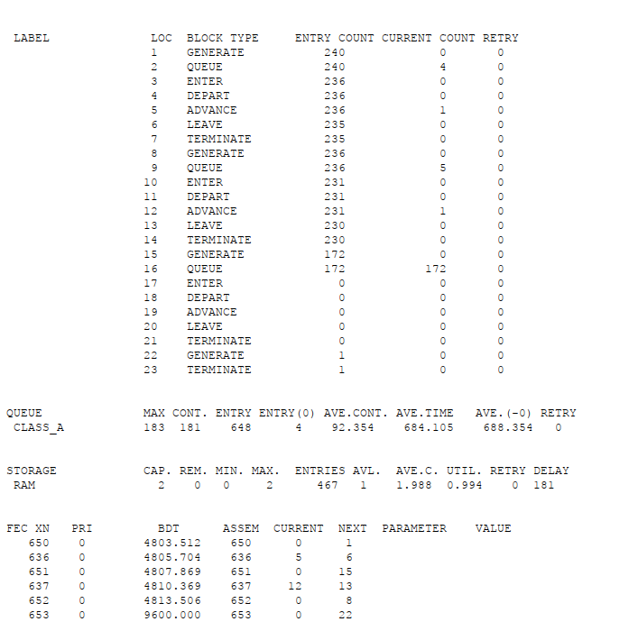
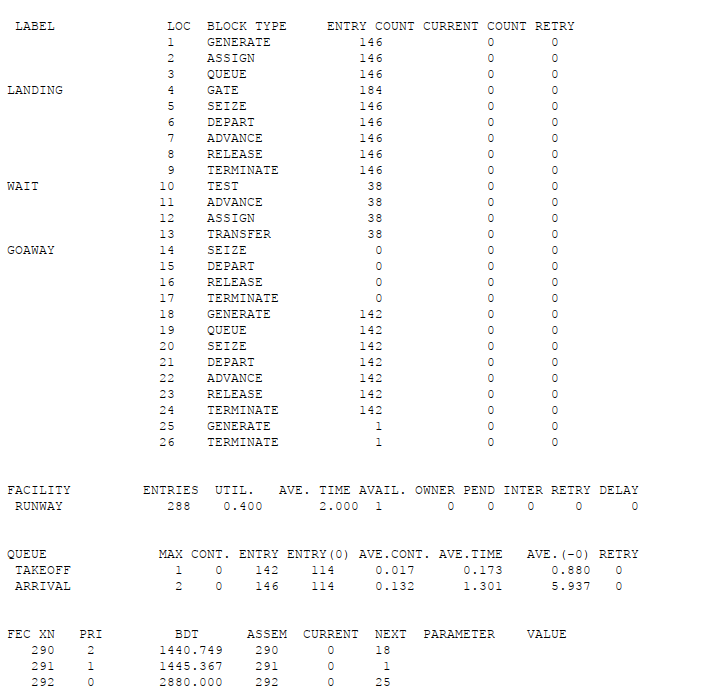
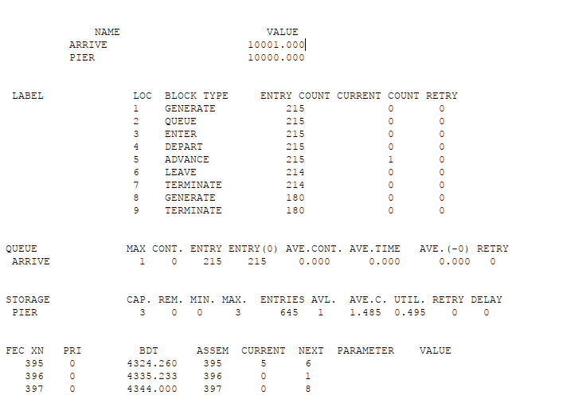

---
## Front matter
lang: ru-RU
title: Лабораторная работа №17
subtitle: Задание для самостоятельной работы
author:
  - Клюкин М. А.
institute:
  - Российский университет дружбы народов, Москва, Россия
  

## i18n babel
babel-lang: russian
babel-otherlangs: english

## Formatting pdf
toc: false
toc-title: Содержание
slide_level: 2
aspectratio: 169
section-titles: true
theme: metropolis
header-includes:
 - \metroset{progressbar=frametitle,sectionpage=progressbar,numbering=fraction}
 - \usepackage{fontspec}
 - \usepackage{polyglossia}
 - \setmainlanguage{russian}
 - \setotherlanguage{english}
 - \newfontfamily\cyrillicfont{Arial}
 - \newfontfamily\cyrillicfontsf{Arial}
 - \newfontfamily\cyrillicfonttt{Arial}
 - \setmainfont{Arial}
 - \setsansfont{Arial}
 
---


## Докладчик

:::::::::::::: {.columns align=center}
::: {.column width="70%"}

  * Клюкин Михаил Александрович
  * студент
  * Российский университет дружбы народов
  * [1132226431@pruf.ru](mailto:1132226431@pfur.ru)
  * <https://MaKYaro.github.io/ru/>

:::
::: {.column width="30%"}


:::
::::::::::::::

## Цель работы

Реализовать с помощью gpss модели работы вычислительного центра, аэропорта и морского порта.

## Задание

Реализовать с помощью gpss:

- модель работы вычислительного центра;
- модель работы аэропорта;
- модель работы морского порта.

# Выполнение лабораторной работы

## Моделирование работы вычислительного центра

```
ram STORAGE 2

GENERATE 20,5
QUEUE class_A
ENTER ram,1
DEPART class_A
ADVANCE 20,5
LEAVE ram,1
TERMINATE 0
```

## Моделирование работы вычислительного центра

```
GENERATE 20,10
QUEUE class_A
ENTER ram,1
DEPART class_A
ADVANCE 21,3
LEAVE ram,1
TERMINATE 0
```

## Моделирование работы вычислительного центра

```
GENERATE 28,5
QUEUE class_A
ENTER ram,2
DEPART class_A
ADVANCE 28,5
LEAVE ram,2
TERMINATE 0

GENERATE 4800
TERMINATE 1
START 1
```

## Моделирование работы вычислительного центра

{#fig:001 width=50%}

## Модель работы аэропорта

```
GENERATE 10,5,,,1
ASSIGN 1,0
QUEUE arrival
landing GATE NU runway,wait
SEIZE runway
DEPART arrival
ADVANCE 2
RELEASE runway
TERMINATE 0
```

## Модель работы аэропорта

```
wait TEST L p1,5,goaway
ADVANCE 5
ASSIGN 1+,1

TRANSFER 0,landing
goaway SEIZE reserve
DEPART arrival
RELEASE reserve
TERMINATE 0
```

## Модель работы аэропорта

```
GENERATE 10,2,,,2
QUEUE takeoff
SEIZE runway
DEPART takeoff
ADVANCE 2
RELEASE runway
TERMINATE 0

GENERATE 1440
TERMINATE 1
START 1
```

## Модель работы аэропорта

{#fig:002 width=50%}

## Моделирование работы морского порта

```
pier STORAGE 10
GENERATE 20,5

QUEUE arrive
ENTER pier,3
DEPART arrive
ADVANCE 10,3
LEAVE pier,3
TERMINATE 0

GENERATE 24
TERMINATE 1
START 180
```

## Моделирование работы морского порта

{#fig:003 width=50%}

## Моделирование работы морского порта

```
pier STORAGE 3
GENERATE 20,5

QUEUE arrive
ENTER pier,3
DEPART arrive
ADVANCE 10,3
LEAVE pier,3
TERMINATE 0

GENERATE 24
TERMINATE 1
START 180
```

## Моделирование работы морского порта

{#fig:004 width=50%}

```
pier STORAGE 6
GENERATE 30,10

QUEUE arrive
ENTER pier,2
DEPART arrive
ADVANCE 8,4
LEAVE pier,2
TERMINATE 0

GENERATE 24
TERMINATE 1
START 180
```

## Моделирование работы морского порта

{#fig:005 width=50%}

## Моделирование работы морского порта

```
pier STORAGE 2
GENERATE 30,10

QUEUE arrive
ENTER pier,2
DEPART arrive
ADVANCE 8,4
LEAVE pier,2
TERMINATE 0

GENERATE 24
TERMINATE 1
START 180
```

## Моделирование работы морского порта

{#fig:006 width=50%}


## Выводы

В результате выполнения данной лабораторной работы реализовали с помощью gpss:

- модель работы вычислительного центра;
- модель работы аэропорта;
- модель работы морского порта.