---
## Front matter
lang: ru-RU
title: Упражнение
subtitle: Построение фигур Лиссажу в xcos
author:
  - Клюкин М. А.
institute:
  - Российский университет дружбы народов, Москва, Россия

## i18n babel
babel-lang: russian
babel-otherlangs: english

## Formatting pdf
toc: false
toc-title: Содержание
slide_level: 2
aspectratio: 169
section-titles: true
theme: metropolis
header-includes:
 - \metroset{progressbar=frametitle,sectionpage=progressbar,numbering=fraction}
 - '\makeatletter'
 - '\beamer@ignorenonframefalse'
 - '\makeatother'
---

# Информация

## Докладчик

:::::::::::::: {.columns align=center}
::: {.column width="70%"}

  * Клюкин Михаил Александрович
  * студент
  * Российский университет дружбы народов
  * [1132226431@pfur.ru](mailto:1132226431@pfur.ru)
  * <https://MaKYaro.github.io/ru/>

:::
::: {.column width="25%"}

:::
::::::::::::::

## Цель работы

Выполнить упражнение по ознакомлению с программой *xcos*.

## Задание

Построить с помощью xcos фигуры Лиссажу со следующими параметрами:

1) $A = B = 1, a = 2, b = 2,  \delta = 0;  \pi/4;  \pi/2;  3\pi/4;  \pi;$

2) $A = B = 1, a = 2, b = 4,  \delta = 0;  \pi/4;  \pi/2;  3\pi/4;  \pi;$

3) $A = B = 1, a = 2, b = 6,  \delta = 0;  \pi/4;  \pi/2;  3\pi/4;  \pi;$

4) $A = B = 1, a = 2, b = 3,  \delta = 0;  \pi/4;  \pi/2;  3\pi/4;  \pi.$

## Фигура Лиссажу

Математическое выражение для кривой Лиссажу:
$$
\begin{cases}
  x(t) = A sin(at + \delta),\\
  y(t) = B sin(bt),
\end{cases}
$$
где $A, B$ -- амплитуды колебаний, $a, b$ -- частоты, $\delta$ -- сдвиг фаз.

## Блоки в xcos

- CLOCK_c -- запуск часов модельного времени;
- GENSIN_f -- блок генератора синусоидального сигнала;
- CSOPXY -- анимированное регистрирующее устройство для построения графика
типа y = f(x);
- TEXT_f -- задаёт текст примечаний.

## Выполнение лабораторной работы

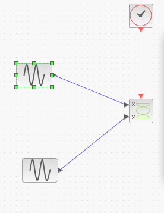{#fig:021 width=70%}

## Выполнение лабораторной работы

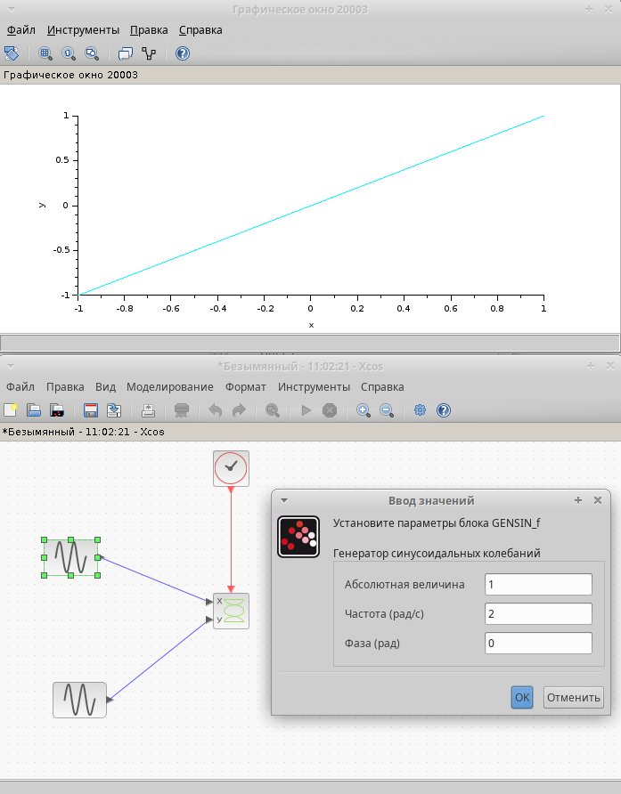{#fig:001 width=70%}

## Выполнение лабораторной работы

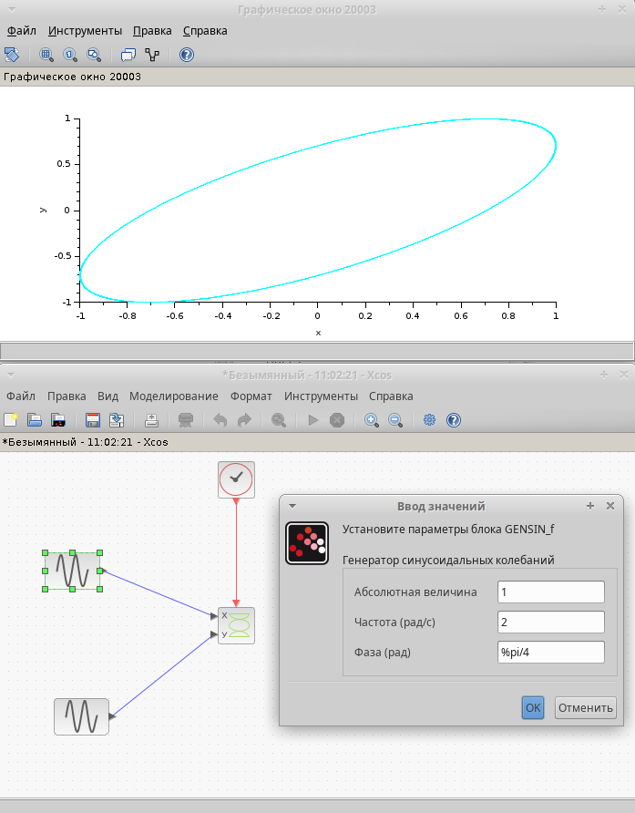{#fig:002 width=70%}

## Выполнение лабораторной работы

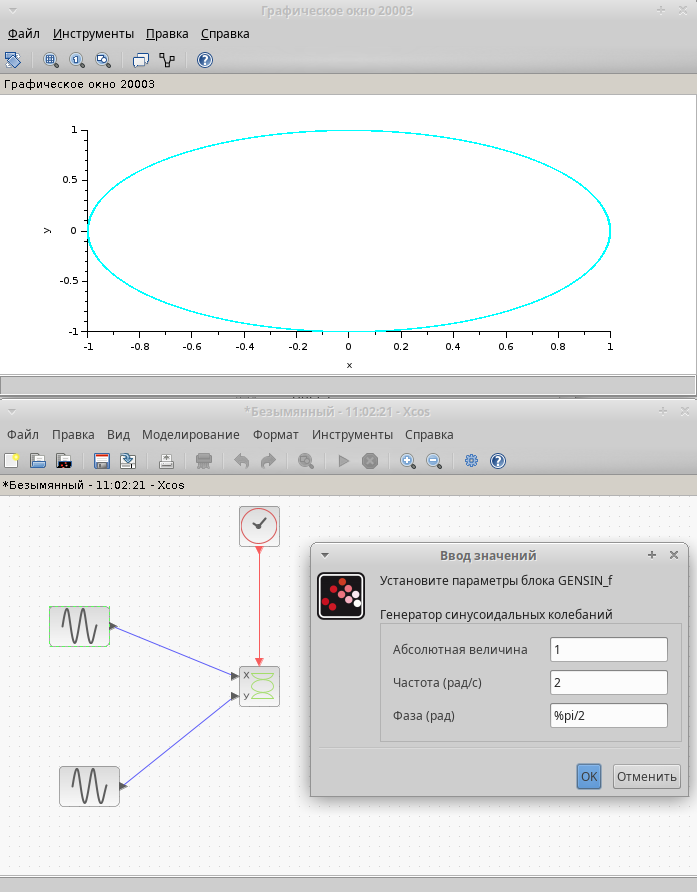{#fig:003 width=70%}

## Выполнение лабораторной работы

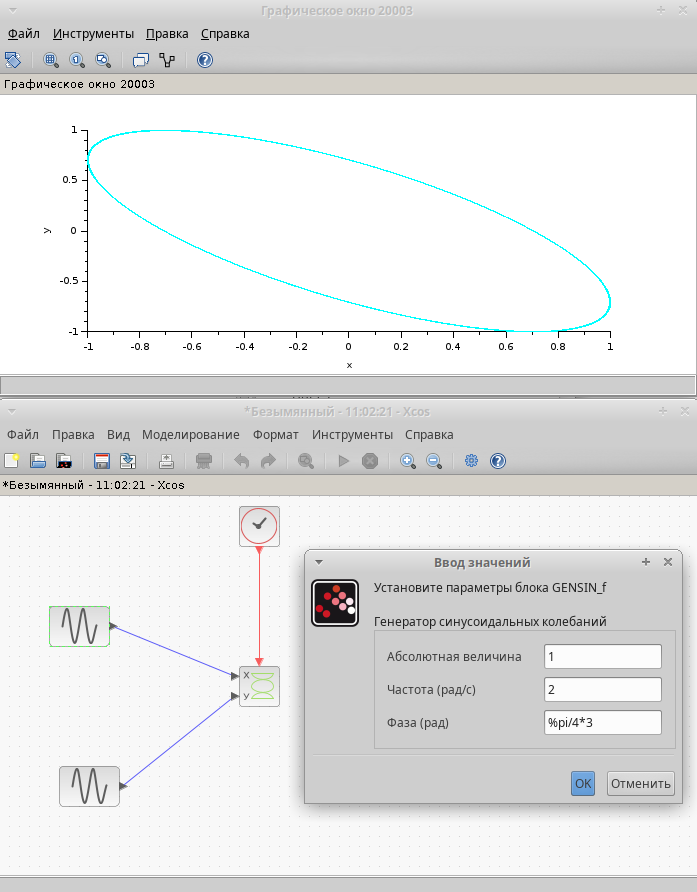{#fig:004 width=70%}

## Выполнение лабораторной работы

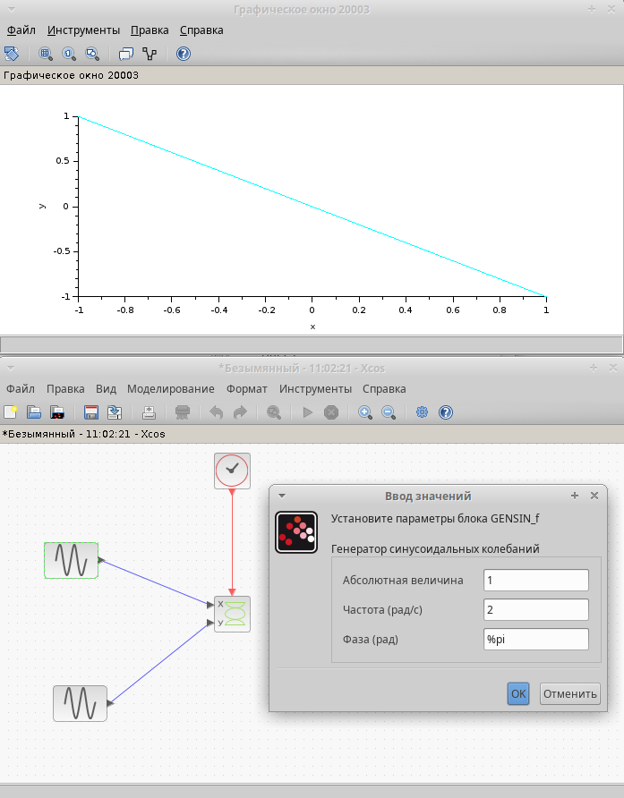{#fig:005 width=70%}

## Выполнение лабораторной работы

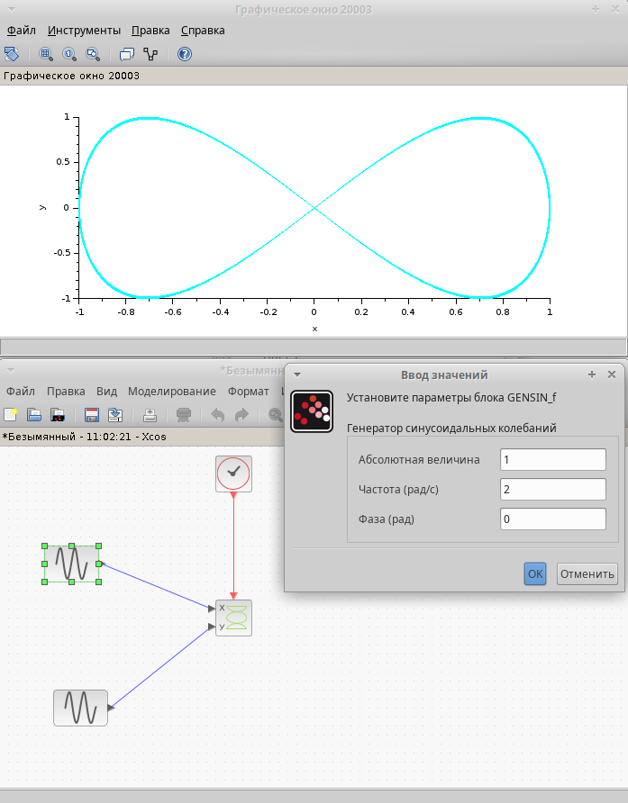{#fig:006 width=70%}

## Выполнение лабораторной работы

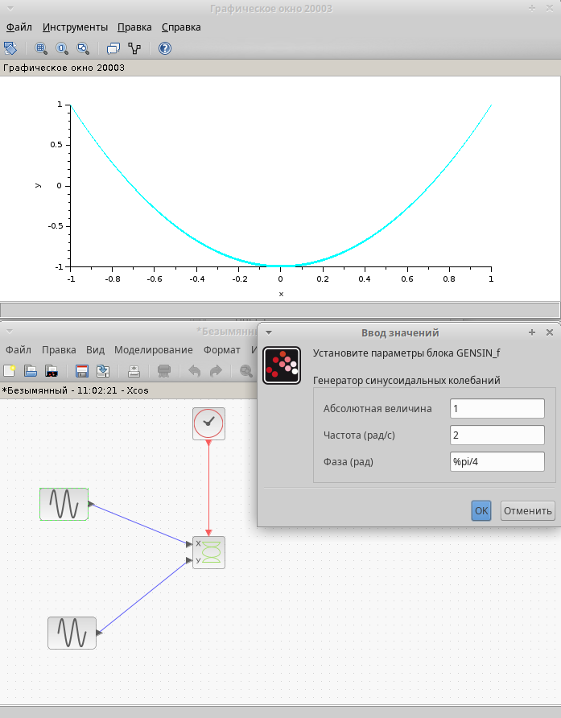{#fig:007 width=70%}

## Выполнение лабораторной работы

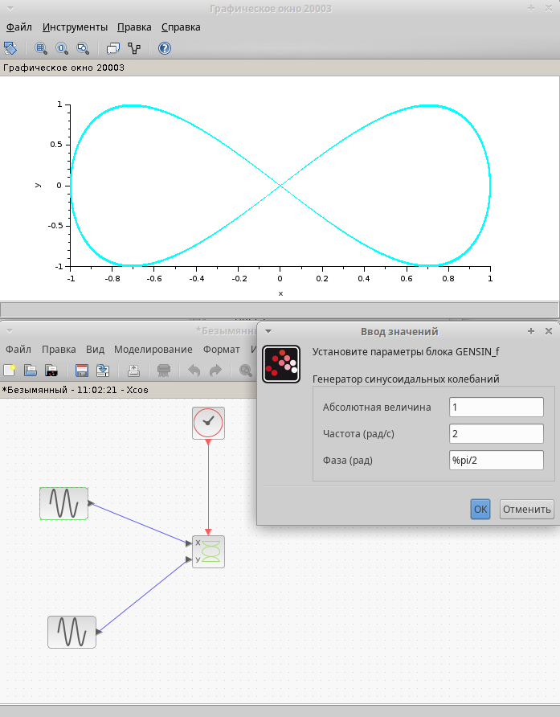{#fig:008 width=70%}

## Выполнение лабораторной работы

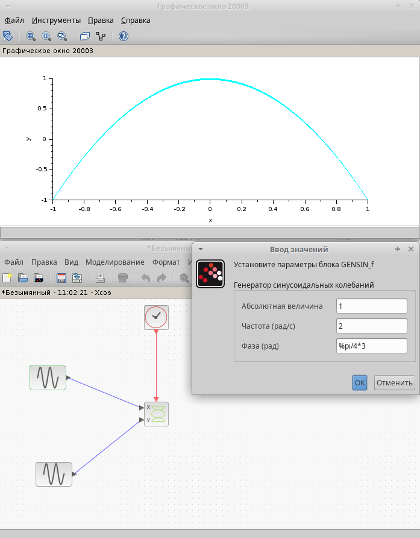{#fig:009 width=70%}

## Выполнение лабораторной работы

{#fig:010 width=70%}

## Выполнение лабораторной работы

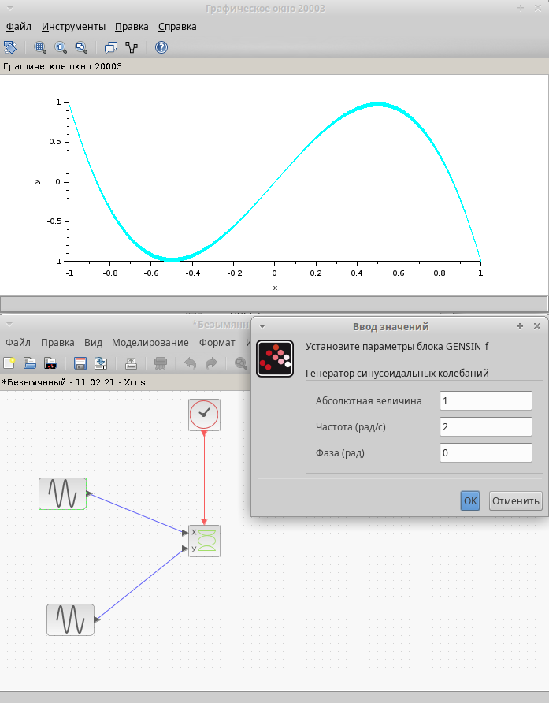{#fig:011 width=70%}

## Выполнение лабораторной работы

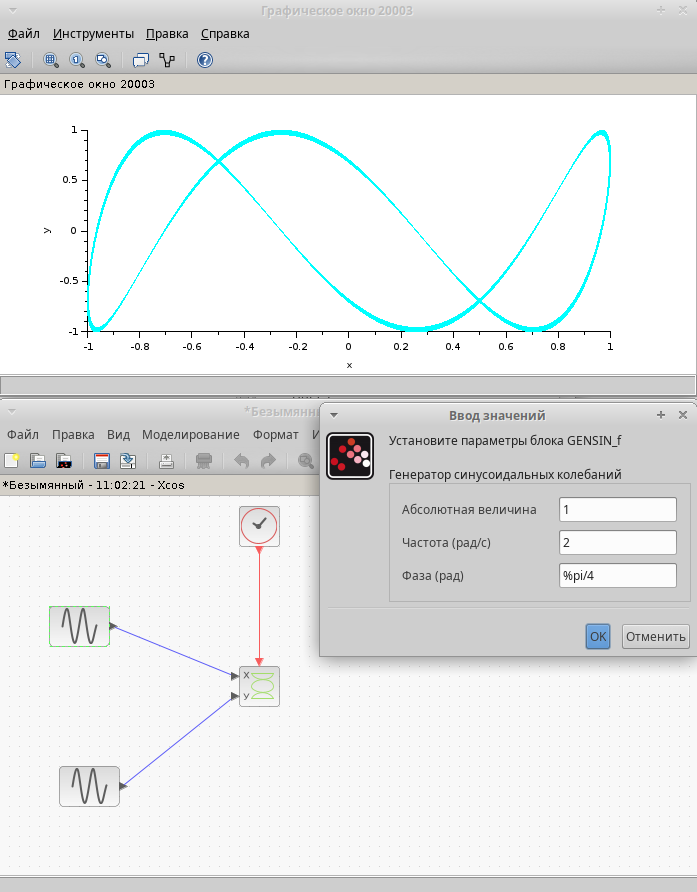{#fig:012 width=70%}

## Выполнение лабораторной работы

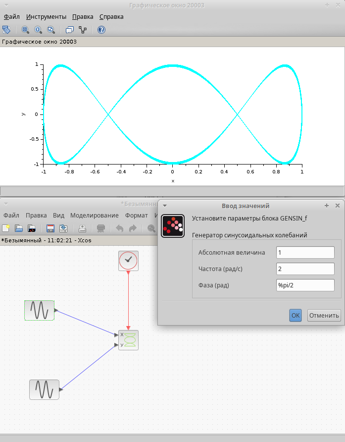{#fig:013 width=70%}

## Выполнение лабораторной работы

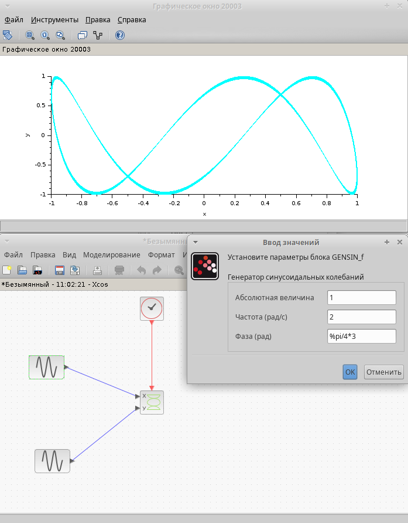{#fig:014 width=70%}

## Выполнение лабораторной работы

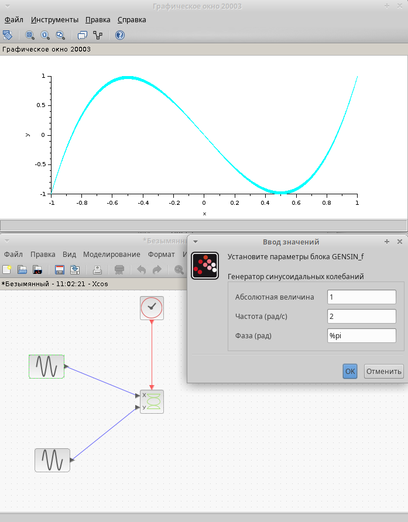{#fig:015 width=70%}

## Выполнение лабораторной работы

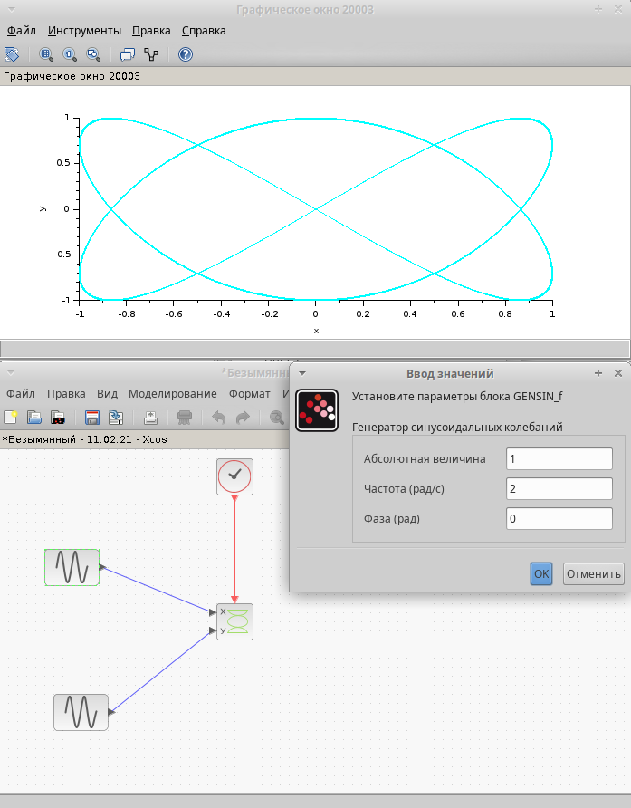{#fig:016 width=70%}

## Выполнение лабораторной работы

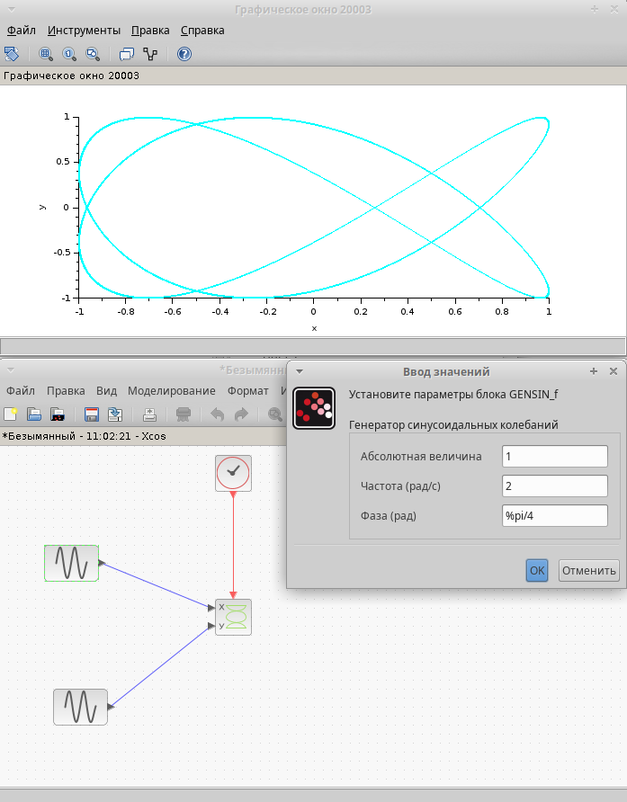{#fig:017 width=70%}

## Выполнение лабораторной работы

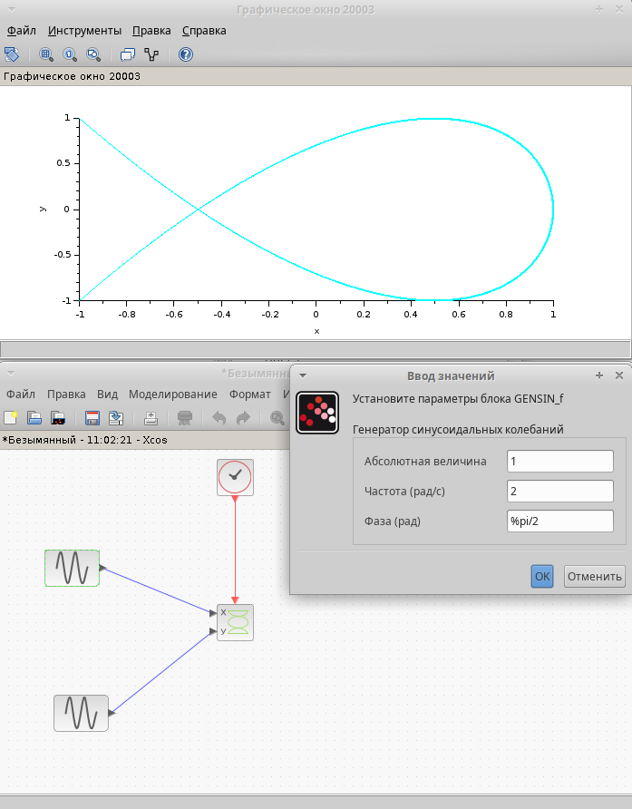{#fig:018 width=70%}

## Выполнение лабораторной работы

{#fig:019 width=70%}

## Выполнение лабораторной работы

{#fig:020 width=70%}

## Выводы

В результате данной лабораторной работы выполнено упражнение по ознакомлению с программой *xcos*.
